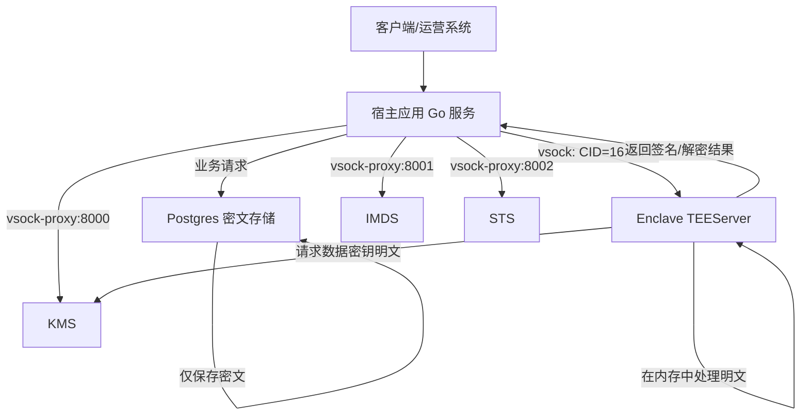
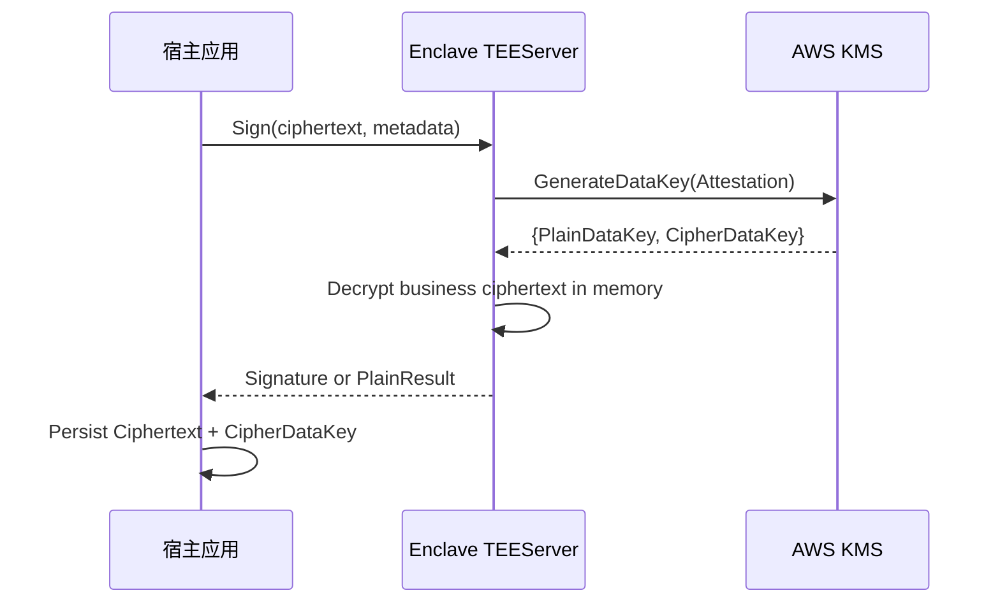
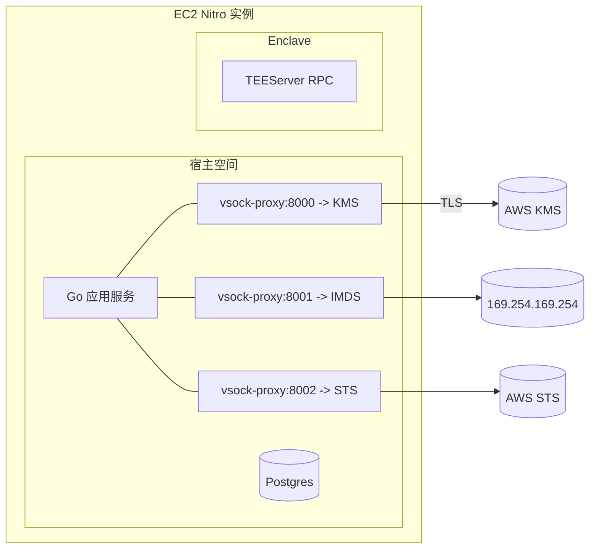
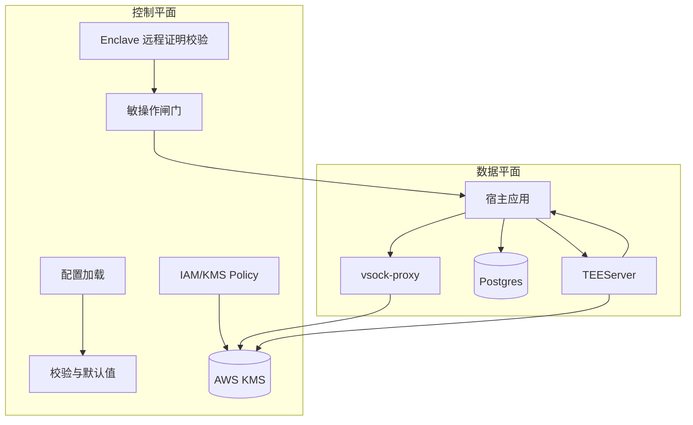

# AWS Nitro Enclaves 集成详细设计（TEE）

**版本**: v1.0  
**日期**: 2025-12-25  
**适用项目**: `go-mpc-wallet`

---

## 1. 背景与目标
- TEE（可信执行环境）用于在受信任隔离区内执行敏感计算，保障数据机密性、代码完整性与可验证性（远程证明）。
- 方案选择：AWS Nitro Enclaves（云端隔离性好、可扩展、攻击面小，满足合规及金融场景需求）。
- 目标：
  - 将密钥操作、签名和敏感解密逻辑迁移到 Enclave，仅在运行时内存使用明文。
  - 使用 KMS 实现信封加密与远程证明绑定，确保只有符合预期测量的 Enclave 能解密密钥材料。
  - 宿主与 Enclave 通过 vsock 通信，宿主负责外部网络访问和存储，数据库仅保存密文。

---

## 1.1 架构图





---

## 2. 总体架构
- 宿主 EC2（Nitro 实例）：继续承载 HTTP/GRPC 服务、数据库访问、配置管理、审计等。
- Enclave：运行“敏感计算服务”（密钥导入/封装、签名、解密、MPC 局部操作），不直接访问磁盘或网络。
- vsock-proxy：在宿主上将 `KMS/IMDS/STS` 等端点代理给 Enclave（仅 Enclave 访问）。
- 数据存储：Postgres 仅存密文（业务密文 + 数据密钥密文），不存明文。
- TLS 与基础设施：宿主继续使用已有 TLS 配置（例如 `docker-compose.yml:69-73`）。

---

## 2.1 部署拓扑图



---

## 2.2 运行时控制与数据平面



---

## 3. 信任与密钥管理
- 使用 AWS KMS Key（对称或非对称）实现信封加密：
  - Enclave 通过 `kmstool_enclave_cli` 或 SDK 请求 KMS 生成数据密钥（返回明文+密文），明文仅在 Enclave 内存中存在。
  - 业务数据在 Enclave 内用明文数据密钥加解密；宿主仅持久化密文数据（ciphertext）和数据密钥密文（data key ciphertext）。
- 远程证明（Attestation）：
  - 绑定 KMS 调用与 Enclave 测量值（PCR），确保只有预期构建的 Enclave 可解密。
  - 宿主在业务启动阶段校验 Enclave 的 Attestation Document，匹配允许的测量值列表。
- 密钥生命周期：
  - 数据密钥明文仅在一次调用中短时存在；用后立即清零内存。
  - 支持密钥轮换，旧数据密文通过 Enclave 逐步重加密。

---

## 4. 运行与部署
### 4.1 先决条件
- 选择 Nitro 支持的实例类型（如 `m6i/c6i` 等）。
- 安装工具链：`nitro-cli`、`vsock-proxy`、`aws-nitro-enclaves-sdk-c`（含 `kmstool_enclave_cli`）。
- 配置 IAM 与 KMS Key Policy：允许 EC2/Nitro Enclaves 调用 KMS，限制仅允许携带正确 Attestation 的请求。

### 4.2 宿主 vsock 代理
```bash
sudo /usr/bin/vsock-proxy 8000 kms.<region>.amazonaws.com 443    # KMS
sudo /usr/bin/vsock-proxy 8001 169.254.169.254 80                # IMDS
sudo /usr/bin/vsock-proxy 8002 sts.<region>.amazonaws.com 443    # STS
```

### 4.3 构建与运行 Enclave
```bash
sudo nitro-cli build-enclave --docker-uri <your-enclave-image>:latest --output-file app.eif
sudo nitro-cli run-enclave --eif-path app.eif --cpu-count 2 --memory 2048 --enclave-cid 16
```

### 4.4 vsock-proxy systemd 单元

```ini
[Unit]
Description=vsock-proxy for KMS
After=network.target

[Service]
ExecStart=/usr/bin/vsock-proxy 8000 kms.<region>.amazonaws.com 443
Restart=always
User=root

[Install]
WantedBy=multi-user.target
```

```ini
[Unit]
Description=vsock-proxy for IMDS
After=network.target

[Service]
ExecStart=/usr/bin/vsock-proxy 8001 169.254.169.254 80
Restart=always
User=root

[Install]
WantedBy=multi-user.target
```

```ini
[Unit]
Description=vsock-proxy for STS
After=network.target

[Service]
ExecStart=/usr/bin/vsock-proxy 8002 sts.<region>.amazonaws.com 443
Restart=always
User=root

[Install]
WantedBy=multi-user.target
```

---

## 5. 服务划分与接口
### 5.1 宿主端（TEEClient）
- 将敏感操作（签名、解密、密钥处理）封装为 vsock RPC 调用。
- 负责入参校验、审计打点、重试策略、幂等控制。

### 5.2 Enclave 端（TEEServer）
- 暴露最小集合 RPC（vsock）：`Sign`, `Decrypt`, `Seal/Unseal` 等。
- 接口入参仅接收密文与操作参数；内部通过 KMS 获取数据密钥明文并处理。
- 不做网络访问、不落盘；错误返回仅限必要信息。

### 5.3 示例接口（演示）
```go
// 宿主：通过 vsock 调用 Enclave 的 Sign
type SignRequest struct { Payload []byte }
type SignResponse struct { Signature []byte }
```

---

## 5.4 配置样例（internal/config 字段与默认值）

YAML 示例：
```yaml
tee:
  enabled: true
  enclaveCID: 16
  vsock:
    kmsPort: 8000
    imdsPort: 8001
    stsPort: 8002
  kmsKeyARN: ""
  allowedPCRs: []
  requestTimeoutSeconds: 5
```

Go 结构体与默认值：
```go
package config

type TEE struct {
	Enabled               bool
	EnclaveCID            uint32
	VsockKMSPort          uint32
	VsockIMDSPort         uint32
	VsockSTSPort          uint32
	KMSKeyARN             string
	AllowedPCRs           []string
	RequestTimeoutSeconds int
}

func DefaultTEE() TEE {
	return TEE{
		Enabled:               true,
		EnclaveCID:            16,
		VsockKMSPort:          8000,
		VsockIMDSPort:         8001,
		VsockSTSPort:          8002,
		KMSKeyARN:             "",
		AllowedPCRs:           []string{},
		RequestTimeoutSeconds: 5,
	}
}
```

### 5.5 配置加载实现（Viper）

```go
package config

import (
	"time"

	"github.com/spf13/viper"
)

type Config struct {
	TEE TEE
}

func Load() (Config, error) {
	v := viper.New()
	v.SetConfigType("yaml")
	v.SetEnvPrefix("APP")
	v.AutomaticEnv()

	v.SetDefault("tee.enabled", true)
	v.SetDefault("tee.enclaveCID", 16)
	v.SetDefault("tee.vsock.kmsPort", 8000)
	v.SetDefault("tee.vsock.imdsPort", 8001)
	v.SetDefault("tee.vsock.stsPort", 8002)
	v.SetDefault("tee.kmsKeyARN", "")
	v.SetDefault("tee.allowedPCRs", []string{})
	v.SetDefault("tee.requestTimeoutSeconds", 5)

	var c Config
	err := v.Unmarshal(&c)
	if err != nil {
		return Config{}, err
	}
	if c.TEE.RequestTimeoutSeconds <= 0 {
		c.TEE.RequestTimeoutSeconds = int((5 * time.Second).Seconds())
	}
	return c, nil
}
```

### 5.6 远程证明校验实现（PCR/Document）

```go
package nitro

import (
	"crypto/sha256"
	"encoding/hex"
)

type AttestationDocument struct {
	PCRs map[int][]byte
}

func VerifyPCRs(doc AttestationDocument, allow []string) bool {
	if len(allow) == 0 {
		return true
	}
	for _, a := range allow {
		found := false
		for _, v := range doc.PCRs {
			sum := sha256.Sum256(v)
			if hex.EncodeToString(sum[:]) == a {
				found = true
				break
			}
		}
		if !found {
			return false
		}
	}
	return true
}
```

### 5.7 KMS Key Policy 与 IAM 示例

```json
{
  "Version": "2012-10-17",
  "Statement": [
    {
      "Sid": "AllowEC2RoleUseOfKeyWithEnclave",
      "Effect": "Allow",
      "Principal": {
        "AWS": "arn:aws:iam::<account-id>:role/<ec2-instance-role>"
      },
      "Action": [
        "kms:Decrypt",
        "kms:GenerateDataKey"
      ],
      "Resource": "*",
      "Condition": {
        "StringEquals": {
          "kms:RecipientAttestation:Os": "aws-nitro-enclaves",
          "kms:RecipientAttestation:IntegrityAlgorithm": "SHA384ECDSA"
        }
      }
    }
  ]
}
```

```json
{
  "Version": "2012-10-17",
  "Statement": [
    {
      "Effect": "Allow",
      "Principal": {
        "Service": "ec2.amazonaws.com"
      },
      "Action": "sts:AssumeRole"
    }
  ]
}
```

---

## 6. 与现有项目的集成点
- `internal/keys`：涉及私钥/份额材料读写与使用的路径，改为通过 TEEClient 调 Enclave。
- `internal/policy`：审批通过后将签名请求转发给 Enclave 而非直接调用本地加密逻辑。
- `internal/crypto/seal`：新增信封加密读写封装（数据库仅存密文）。
- `internal/config`：新增 KMS Key ARN、允许的 PCR、vsock 端口等配置项。
- `docker-compose.yml`：本地开发不支持 Nitro Enclaves；生产在 AWS 环境部署 Enclave。已有 TLS 配置参考：
  - `MPC_TLS_CERT_FILE`, `MPC_TLS_KEY_FILE`, `MPC_TLS_CA_CERT_FILE`（`/Users/caimin/Desktop/kms/go-mpc-wallet/docker-compose.yml:69-73`）

---

## 7. 数据库与迁移变更
- 模型变更：为敏感字段新增密文存储结构，例如：
  - `ciphertext_blob TEXT`（Base64）
  - `data_key_ciphertext TEXT`（KMS 返回的数据密钥密文）
  - `kms_key_id TEXT`
  - `created_at TIMESTAMPTZ`
- 迁移示例：
```sql
ALTER TABLE keys
  ADD COLUMN ciphertext_blob TEXT,
  ADD COLUMN data_key_ciphertext TEXT,
  ADD COLUMN kms_key_id TEXT;
```
- 模型生成：在容器内执行 `make sql-regenerate`，已验证通过。

---

## 8. 安全设计
- 远程证明强校验：启动阶段获取 Enclave Attestation，校验 PCR 与签名。
- 最小接口面：Enclave 仅提供必要 RPC，不执行外部命令或自定义网络访问。
- 审计与防回放：每次调用携带请求 ID、时间窗校验；记录摘要与结果类型。
- 日志红线：不记录明文、密钥材料；只记录元数据。
- 内存清理：敏感明文用后立即清零；避免长时间持有。
- 失败处理：明确错误码与降级策略（拒绝敏操作，保留审计）。

---

## 9. 运维与监控
- 指标：RPC 成功率、时延、KMS 调用次数、错误率。
- 日志：调用链路 ID、审计事件、异常原因。
- 备份：仅密文备份；密钥轮换策略与重加密流程。
- 灾备：Enclave 重建与测量值更新流程；更新允许列表。

### 9.1 指标与日志

```go
package teeobs

import (
	"sync/atomic"
)

var Calls uint64
var Errors uint64

func IncCalls() {
	atomic.AddUint64(&Calls, 1)
}

func IncErrors() {
	atomic.AddUint64(&Errors, 1)
}
```

### 9.2 OpenTelemetry 事件命名
- `tee.client.request`
- `tee.client.error`
- `tee.server.call`
- `tee.server.latency`

---

## 10. 测试计划
- 单元测试：宿主侧 TEEClient 入参校验与幂等；密文读写封装。
- 集成测试：vsock stub 环境模拟；KMS 调用模拟/沙箱。
- 性能测试：vsock 吞吐与延迟评估；并发请求稳定性。
- 故障注入：KMS 不可用、Attestation 不匹配、内存不足、RPC 超时。

### 10.1 集成测试要点
- vsock RPC 编解码正确性
- KMS 代理与密钥生命周期
- PCR 校验在测量变化时阻断敏操作
- 并发与吞吐边界

### 10.2 压测指标
- P50/P95 延迟
- QPS 极限
- 错误率与降级行为

---

## 11. 风险与限制
- vsock 通信带宽与延迟限制，影响高吞吐场景。
- Enclave 不支持持久化，所有数据仅在内存；设计必须围绕密文持久化。
- 依赖 Nitro 实例与 AWS 环境；本地开发需要替代或模拟方案。
- 成本与复杂度上升，需权衡接入范围与收益。

### 11.1 威胁模型
- 宿主被入侵但无法读取 Enclave 内明文
- 代理端点被滥用需要最小化可用端口与鉴权
- 测量值更新导致老 Enclave 不可用

### 11.2 缓解
- 严格 PCR 白名单与发布流程
- 仅允许必要 KMS 方法
- 最小接口面与速率限制

---

## 12. 实施里程碑
- 阶段 A（设计与准备）：确定接口与数据结构、KMS/Attestation 策略、IAM/KMS 配置。
- 阶段 B（最小可用）：实现 Enclave `Sign/Decrypt`，接入一个敏感路径（如签名）。
- 阶段 C（扩展与稳定）：覆盖密钥/份额管理、轮换与审计；性能与可靠性优化。
- 阶段 D（上线与维护）：生产部署、监控与响应流程、定期审计。

---

## 13. 附录：命令与示例
### 13.1 vsock-proxy 启动
```bash
sudo /usr/bin/vsock-proxy 8000 kms.<region>.amazonaws.com 443
sudo /usr/bin/vsock-proxy 8001 169.254.169.254 80
sudo /usr/bin/vsock-proxy 8002 sts.<region>.amazonaws.com 443
```

### 13.2 Enclave 构建与运行
```bash
sudo nitro-cli build-enclave --docker-uri <your-enclave-image>:latest --output-file app.eif
sudo nitro-cli run-enclave --eif-path app.eif --cpu-count 2 --memory 2048 --enclave-cid 16
```

### 13.3 KMS（Enclave 内）
```bash
# 生成数据密钥（通过宿主 CID=3 的 KMS 代理）
kmstool_enclave_cli generate-data-key \
  --key-id <KMS_KEY_ARN> \
  --audience kms \
  --key-spec AES-256 \
  --endpoint 3:8000

# 解密数据密文
kmstool_enclave_cli decrypt \
  --ciphertext <BASE64_CIPHERTEXT> \
  --endpoint 3:8000
```

### 13.4 Attestation 获取与校验
```bash
nitro-cli describe-enclaves
nitro-cli console --enclave-id <id>
```

---

## 14. 与现有文档的关系
- 本设计文档专注于 TEE 集成（Nitro Enclaves），与现有 `MPCVault_Server_Design.md` 的业务架构相互补充。
- 上线后需在运维手册与安全策略中加入 TEE 专章。

---

## 15. 最小代码草案

### 15.1 TEEClient（重试与超时）
```go
package nitro

import (
	"context"
	"encoding/json"
	"errors"
	"time"

	"github.com/mdlayher/vsock"
)

type SignRequest struct {
	Payload []byte
}

type SignResponse struct {
	Signature []byte
}

func CallEnclaveSignWithRetry(ctx context.Context, cid uint32, port uint32, req SignRequest, retries int, timeout time.Duration) (SignResponse, error) {
	var lastErr error
	for i := 0; i < retries; i++ {
		c, err := vsock.Dial(cid, port)
		if err != nil {
			lastErr = err
			time.Sleep(100 * time.Millisecond)
			continue
		}
		_ = c.SetDeadline(time.Now().Add(timeout))
		enc := json.NewEncoder(c)
		dec := json.NewDecoder(c)
		if err := enc.Encode(&req); err != nil {
			lastErr = err
			_ = c.Close()
			time.Sleep(100 * time.Millisecond)
			continue
		}
		var resp SignResponse
		if err := dec.Decode(&resp); err != nil {
			lastErr = err
			_ = c.Close()
			time.Sleep(100 * time.Millisecond)
			continue
		}
		_ = c.Close()
		return resp, nil
	}
	return SignResponse{}, errors.New("tee call failed")
}
```

### 15.2 TEEServer（并发与输入校验）
```go
package nitro

import (
	"encoding/json"
	"net"

	"github.com/mdlayher/vsock"
)

type SignRequest struct {
	Payload []byte
}

type SignResponse struct {
	Signature []byte
}

func RunEnclaveServerWithLimit(port uint32, priv []byte, maxConcurrent int) error {
	ln, err := vsock.Listen(vsock.AnyCID, port)
	if err != nil {
		return err
	}
	defer ln.Close()
	sem := make(chan struct{}, maxConcurrent)
	for {
		conn, err := ln.Accept()
		if err != nil {
			return err
		}
		sem <- struct{}{}
		go func(c net.Conn) {
			defer func() { <-sem }()
			defer c.Close()
			var req SignRequest
			if err := json.NewDecoder(c).Decode(&req); err != nil {
				return
			}
			if len(req.Payload) == 0 {
				_ = json.NewEncoder(c).Encode(&SignResponse{Signature: nil})
				return
			}
			sig := sign(priv, req.Payload)
			_ = json.NewEncoder(c).Encode(&SignResponse{Signature: sig})
		}(conn)
	}
}

func sign(priv []byte, data []byte) []byte {
	return []byte{}
}
```

TEEClient（宿主端）：
```go
package nitro

import (
	"encoding/json"
	"time"

	"github.com/mdlayher/vsock"
)

type SignRequest struct {
	Payload []byte
}

type SignResponse struct {
	Signature []byte
}

func CallEnclaveSign(cid uint32, port uint32, req SignRequest) (SignResponse, error) {
	c, err := vsock.Dial(cid, port)
	if err != nil {
		return SignResponse{}, err
	}
	defer c.Close()
	_ = c.SetDeadline(time.Now().Add(time.Duration(5) * time.Second))
	enc := json.NewEncoder(c)
	dec := json.NewDecoder(c)
	if err := enc.Encode(&req); err != nil {
		return SignResponse{}, err
	}
	var resp SignResponse
	if err := dec.Decode(&resp); err != nil {
		return SignResponse{}, err
	}
	return resp, nil
}
```

TEEServer（Enclave 端）：
```go
package nitro

import (
	"encoding/json"
	"net"

	"github.com/mdlayher/vsock"
)

type SignRequest struct {
	Payload []byte
}

type SignResponse struct {
	Signature []byte
}

func RunEnclaveServer(port uint32, priv []byte) error {
	ln, err := vsock.Listen(vsock.AnyCID, port)
	if err != nil {
		return err
	}
	defer ln.Close()
	for {
		conn, err := ln.Accept()
		if err != nil {
			return err
		}
		go func(c net.Conn) {
			defer c.Close()
			var req SignRequest
			if err := json.NewDecoder(c).Decode(&req); err != nil {
				return
			}
			sig := sign(priv, req.Payload)
			_ = json.NewEncoder(c).Encode(&SignResponse{Signature: sig})
		}(conn)
	}
}

func sign(priv []byte, data []byte) []byte {
	return []byte{}
}
```
