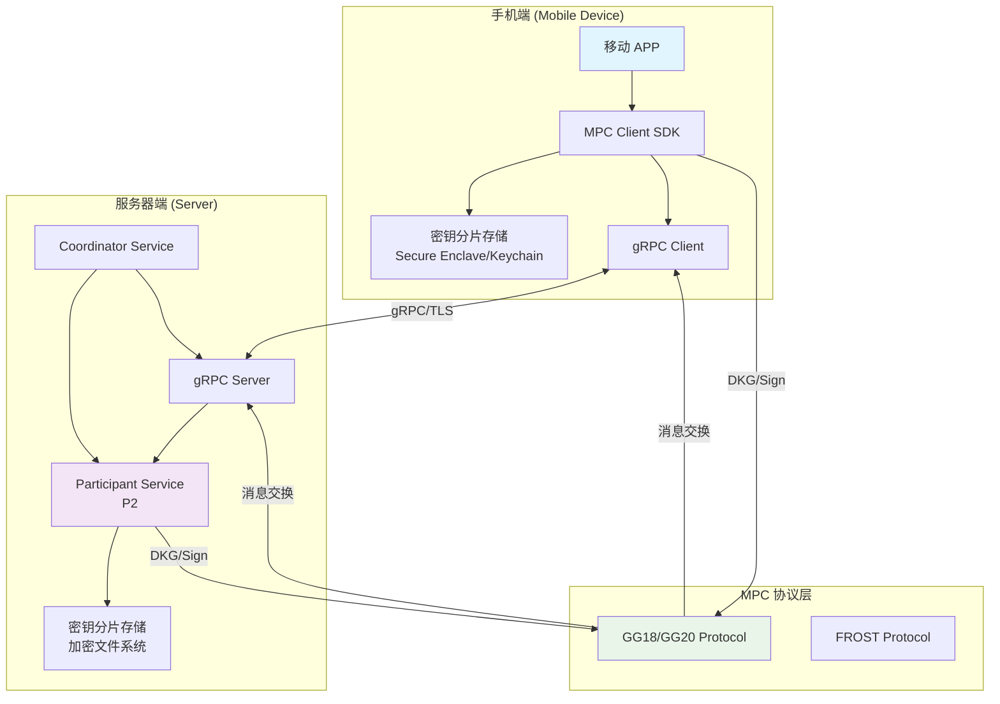
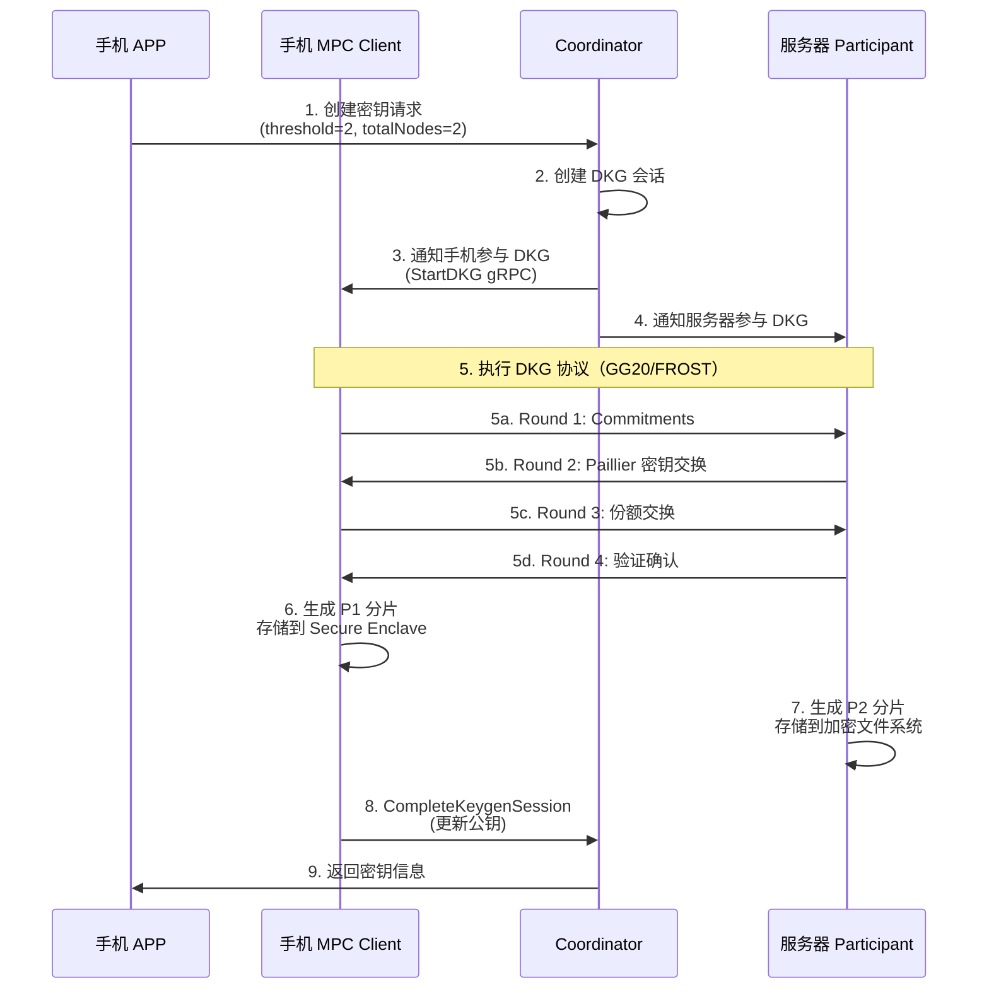
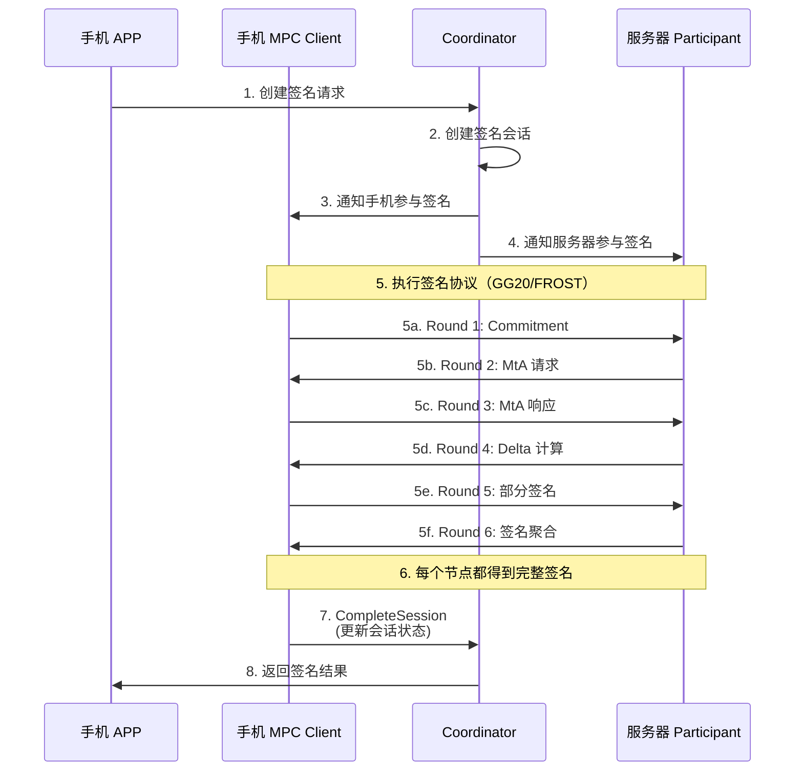
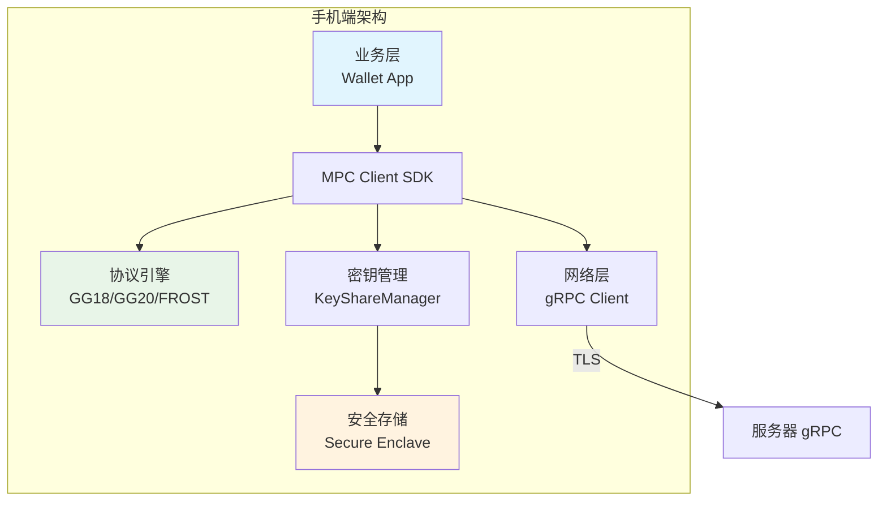

# 手机端 2-of-2 MPC 集成指南

**版本**: v1.0  
**日期**: 2025-01-20  
**适用项目**: `go-mpc-wallet`  
**模式**: 2-of-2 阈值签名（手机 P1 + 服务器 P2）

---

## 目录

- [1. 概述](#1-概述)
- [2. 架构设计](#2-架构设计)
- [3. 服务端修改清单](#3-服务端修改清单)
- [4. 手机端适配方案](#4-手机端适配方案)
- [5. 实施步骤](#5-实施步骤)
- [6. 测试验证](#6-测试验证)
- [7. 常见问题](#7-常见问题)

---

## 1. 概述

### 1.1 背景

当前项目采用 **2-of-3 模式**（服务器节点参与），需要改为 **2-of-2 模式**，让手机设备作为 MPC 参与方（P1），与服务器（P2）协同完成 DKG 和阈值签名。

### 1.2 核心变化

| 项目 | 2-of-3 模式（当前） | 2-of-2 模式（目标） |
|------|---------------------|---------------------|
| **参与节点** | server-proxy-1, server-proxy-2, server-backup-1 | 手机设备（P1）+ 服务器（P2） |
| **阈值** | 2 | 2 |
| **总节点数** | 3 | 2 |
| **容错性** | 可容忍1个节点故障 | 无容错（必须2个节点都在线） |
| **密钥分片** | 3个分片，存储在3个服务器节点 | 2个分片，手机和服务器各1个 |
| **DKG 参与** | 仅服务器节点 | 手机 + 服务器 |
| **签名参与** | 仅服务器节点 | 手机 + 服务器 |

### 1.3 技术可行性

✅ **完全可行**，原因：
- tss-lib 原生支持 2-of-2 模式
- 当前项目架构已支持动态节点选择
- gRPC 通信机制支持移动端接入
- 协议引擎（GG18/GG20/FROST）支持任意阈值配置

---

## 2. 架构设计

### 2.1 整体架构



### 2.2 密钥分片分配

```
2-of-2 密钥分片分配：
├── P1（手机端）
│   ├── 存储位置：Secure Enclave（iOS）/ TrustZone（Android）
│   ├── 加密方式：硬件加密 + AES-256-GCM
│   ├── 访问控制：生物认证（FaceID/TouchID/指纹）
│   └── 备份策略：用户自主备份（可选）
│
└── P2（服务器端）
    ├── 存储位置：加密文件系统 / TEE（可选）
    ├── 加密方式：AES-256-GCM
    ├── 访问控制：节点认证 + TLS
    └── 备份策略：服务器端备份（加密）
```

### 2.3 DKG 流程（2-of-2）



### 2.4 签名流程（2-of-2）



---

## 3. 服务端修改清单

### 3.1 核心修改点

#### 3.1.1 节点选择逻辑修改

**文件**: `internal/infra/signing/service.go`

**当前代码**（2-of-3 模式）:
```go
if keyMetadata.Threshold == 2 && keyMetadata.TotalNodes == 3 {
    // 固定 2-of-3 模式：使用固定的服务器节点列表
    participatingNodes = []string{"server-proxy-1", "server-proxy-2"}
}
```

**修改为**（支持 2-of-2 模式）:
```go
if keyMetadata.Threshold == 2 && keyMetadata.TotalNodes == 2 {
    // 2-of-2 模式：手机 P1 + 服务器 P2
    // 从会话或请求中获取手机节点ID
    mobileNodeID := getMobileNodeID(ctx, req)
    if mobileNodeID == "" {
        return nil, errors.New("mobile node ID is required for 2-of-2 mode")
    }
    participatingNodes = []string{mobileNodeID, "server-p2"}
    
    log.Info().
        Str("key_id", req.KeyID).
        Strs("participating_nodes", participatingNodes).
        Int("threshold", keyMetadata.Threshold).
        Int("total_nodes", keyMetadata.TotalNodes).
        Msg("Using 2-of-2 mode: mobile + server")
} else if keyMetadata.Threshold == 2 && keyMetadata.TotalNodes == 3 {
    // 保持向后兼容：2-of-3 模式
    participatingNodes = []string{"server-proxy-1", "server-proxy-2"}
}
```

#### 3.1.2 DKG 节点选择修改

**文件**: `internal/infra/key/dkg.go`

**当前代码**:
```go
if req.Threshold == 2 && req.TotalNodes == 3 {
    nodeIDs = []string{"server-proxy-1", "server-proxy-2", "server-backup-1"}
}
```

**修改为**:
```go
if req.Threshold == 2 && req.TotalNodes == 2 {
    // 2-of-2 模式：从请求中获取手机节点ID
    mobileNodeID := req.MobileNodeID
    if mobileNodeID == "" {
        return nil, errors.New("mobile node ID is required for 2-of-2 DKG")
    }
    nodeIDs = []string{mobileNodeID, "server-p2"}
    
    log.Info().
        Str("key_id", keyID).
        Strs("node_ids", nodeIDs).
        Int("node_count", len(nodeIDs)).
        Msg("ExecuteDKG: Using 2-of-2 mode")
} else if req.Threshold == 2 && req.TotalNodes == 3 {
    // 保持向后兼容：2-of-3 模式
    nodeIDs = []string{"server-proxy-1", "server-proxy-2", "server-backup-1"}
}
```

#### 3.1.3 节点注册和发现

**文件**: `internal/mpc/node/manager.go`

**需要支持**:
- 手机节点注册（动态节点ID，如 `mobile-{userID}-{deviceID}`）
- 节点类型识别（`mobile` vs `server`）
- 节点状态管理（在线/离线）

**新增接口**:
```go
// RegisterMobileNode 注册手机节点
func (m *Manager) RegisterMobileNode(ctx context.Context, nodeID string, endpoint string, publicKey string) error {
    node := &Node{
        NodeID:    nodeID,
        NodeType:  NodeTypeMobile, // 新增类型
        Endpoint:  endpoint,
        PublicKey: publicKey,
        Status:    NodeStatusActive,
        Purpose:   "signing",
    }
    return m.metadataStore.SaveNode(ctx, node)
}
```

#### 3.1.4 API 接口修改

**文件**: `internal/api/handlers/infra/keys/post_create_key.go`

**请求参数扩展**:
```go
type PostCreateKeyPayload struct {
    Algorithm  string `json:"algorithm" validate:"required"`
    Curve      string `json:"curve" validate:"required"`
    Threshold  int    `json:"threshold" validate:"required"`
    TotalNodes int    `json:"total_nodes" validate:"required"`
    ChainType  string `json:"chain_type" validate:"required"`
    // 新增：手机节点ID（2-of-2 模式必需）
    MobileNodeID string `json:"mobile_node_id,omitempty"`
}
```

**文件**: `internal/api/handlers/infra/signing/post_sign.go`

**请求参数扩展**:
```go
type PostSignPayload struct {
    KeyID      string `json:"key_id" validate:"required"`
    Message    string `json:"message" validate:"required"`
    ChainType  string `json:"chain_type" validate:"required"`
    // 新增：手机节点ID（2-of-2 模式必需）
    MobileNodeID string `json:"mobile_node_id,omitempty"`
}
```

### 3.2 数据库修改

#### 3.2.1 Nodes 表扩展

**迁移文件**: `migrations/YYYYMMDDHHMMSS-add-mobile-node-support.sql`

```sql
-- 添加节点类型支持（如果还没有）
ALTER TABLE nodes ADD COLUMN IF NOT EXISTS node_type VARCHAR(50) DEFAULT 'participant';
ALTER TABLE nodes ADD COLUMN IF NOT EXISTS device_type VARCHAR(50); -- 'mobile', 'server'
ALTER TABLE nodes ADD COLUMN IF NOT EXISTS user_id VARCHAR(255); -- 手机节点关联的用户ID
ALTER TABLE nodes ADD COLUMN IF NOT EXISTS device_id VARCHAR(255); -- 设备唯一标识

-- 创建索引
CREATE INDEX IF NOT EXISTS idx_nodes_type ON nodes(node_type);
CREATE INDEX IF NOT EXISTS idx_nodes_device_type ON nodes(device_type);
CREATE INDEX IF NOT EXISTS idx_nodes_user_id ON nodes(user_id);
```

#### 3.2.2 Keys 表扩展

```sql
-- 添加手机节点关联（可选，用于快速查询）
ALTER TABLE keys ADD COLUMN IF NOT EXISTS mobile_node_id VARCHAR(255);
CREATE INDEX IF NOT EXISTS idx_keys_mobile_node_id ON keys(mobile_node_id);
```

### 3.3 gRPC 服务修改

#### 3.3.1 支持移动端连接

**文件**: `internal/mpc/grpc/server.go`

**需要支持**:
- 移动端 gRPC 连接（TLS 认证）
- 动态节点注册
- 心跳保活机制

**配置示例**:
```go
// gRPC 服务器配置（支持移动端）
serverConfig := &ServerConfig{
    Port:           9090,
    TLSEnabled:     true, // 必须启用 TLS
    MaxConnAge:     2 * time.Hour,
    KeepAlive:      10 * time.Minute,
    // 支持移动端连接
    AllowMobileNodes: true,
}
```

### 3.4 配置修改

**文件**: `internal/config/server_config.go`

**新增配置项**:
```go
type MPC struct {
    // ... 现有配置
    
    // 2-of-2 模式配置
    Enable2of2Mode    bool   // 是否启用 2-of-2 模式
    MobileNodePrefix  string // 手机节点ID前缀（默认 "mobile-"）
    ServerNodeID      string // 服务器节点ID（默认 "server-p2"）
    
    // 移动端连接配置
    MobileGRPCEndpoint string // 移动端 gRPC 端点
    MobileTLSCertFile  string // 移动端 TLS 证书
}
```

---

## 4. 手机端适配方案

### 4.1 架构设计



### 4.2 iOS 实现方案

#### 4.2.1 项目结构

```
MPCWalletSDK-iOS/
├── MPCWalletSDK/
│   ├── Core/
│   │   ├── MPCClient.swift          # MPC 客户端主类
│   │   ├── ProtocolEngine.swift     # 协议引擎（GG18/GG20/FROST）
│   │   └── KeyShareManager.swift    # 密钥分片管理
│   ├── Security/
│   │   ├── SecureStorage.swift      # Secure Enclave 存储
│   │   └── KeychainManager.swift    # Keychain 管理
│   ├── Network/
│   │   ├── GRPCClient.swift          # gRPC 客户端
│   │   └── NetworkManager.swift     # 网络管理
│   └── Models/
│       ├── KeyShare.swift
│       ├── SigningRequest.swift
│       └── DKGRequest.swift
└── MPCWalletSDK.podspec
```

#### 4.2.2 核心实现（基于 tss-lib/mobile）

**MPCClient.swift**:
```swift
import Foundation
import Security
import LocalAuthentication
import TssLib  // tss-lib 移动端框架

public class MPCClient {
    private let nodeID: String
    private let serverEndpoint: String
    private let grpcClient: GRPCClient
    private let keyShareManager: KeyShareManager
    private let partyManager: PartyManager
    
    public init(nodeID: String, serverEndpoint: String) {
        self.nodeID = nodeID
        self.serverEndpoint = serverEndpoint
        self.grpcClient = GRPCClient(endpoint: serverEndpoint)
        self.keyShareManager = KeyShareManager()
        self.partyManager = PartyManager()
        
        // 设置消息处理器
        let msgHandler = MessageHandlerImpl(grpcClient: grpcClient)
        partyManager.setMessageHandler(msgHandler)
        
        // 设置完成处理器
        let completeHandler = CompletionHandlerImpl(keyShareManager: keyShareManager)
        partyManager.setCompletionHandler(completeHandler)
        
        // 创建并设置当前 PartyID
        let keyHex = generateUniqueKeyHex() // 生成唯一密钥（32字节hex）
        try? partyManager.createPartyID(nodeID, moniker: "Mobile Node", keyHex: keyHex)
        try? partyManager.setCurrentPartyID(nodeID)
    }
    
    // 参与 DKG
    public func participateDKG(
        keyID: String,
        curve: String,
        threshold: Int,
        totalNodes: Int,
        otherNodes: [String]
    ) async throws {
        // 1. 准备参与方 ID 列表
        let partyIDs = [nodeID] + otherNodes
        let partyIDsJSON = try JSONSerialization.data(withJSONObject: partyIDs)
        let partyIDsJSONString = String(data: partyIDsJSON, encoding: .utf8)!
        
        // 2. 可选：生成预参数（需要几分钟，建议提前生成）
        let preParamsJSON = try? GeneratePreParams(60)
        
        // 3. 启动 DKG 协议
        try partyManager.startKeygen(
            curveName: curve,  // "secp256k1" 或 "ed25519"
            partyIDsJSON: partyIDsJSONString,
            threshold: threshold,
            preParamsJSON: preParamsJSON ?? ""
        )
        
        // 4. 等待完成（通过 CompletionHandler 回调）
        // 密钥数据会在 onKeygenComplete 回调中返回
    }
    
    // 参与签名
    public func participateSigning(
        keyID: String,
        message: Data,
        sessionID: String,
        otherNodes: [String]
    ) async throws {
        // 1. 从 Secure Enclave 加载密钥数据
        let keyDataJSON = try keyShareManager.loadKeyDataJSON(keyID: keyID)
        
        // 2. 准备参与方 ID 列表
        let partyIDs = [nodeID] + otherNodes
        let partyIDsJSON = try JSONSerialization.data(withJSONObject: partyIDs)
        let partyIDsJSONString = String(data: partyIDsJSON, encoding: .utf8)!
        
        // 3. 将消息转换为 hex
        let messageHex = message.map { String(format: "%02x", $0) }.joined()
        
        // 4. 启动签名协议
        try partyManager.startSigning(
            messageHex: messageHex,
            curveName: "secp256k1",
            partyIDsJSON: partyIDsJSONString,
            keyDataJSON: keyDataJSON
        )
        
        // 5. 等待完成（通过 CompletionHandler 回调）
        // 签名会在 onSignComplete 回调中返回
    }
    
    // 处理接收到的消息
    public func handleIncomingMessage(
        wireBytes: Data,
        fromID: String,
        isBroadcast: Bool
    ) throws {
        try partyManager.updateFromBytes(wireBytes, fromID: fromID, isBroadcast: isBroadcast)
    }
}

// 消息处理器实现
class MessageHandlerImpl: NSObject, MessageHandler {
    private let grpcClient: GRPCClient
    
    init(grpcClient: GRPCClient) {
        self.grpcClient = grpcClient
    }
    
    func onMessage(_ wireBytes: Data, fromID: String, toIDsJSON: String, isBroadcast: Bool) {
        // 解析接收方 ID 列表
        if let data = toIDsJSON.data(using: .utf8),
           let toIDs = try? JSONDecoder().decode([String].self, from: data),
           !toIDs.isEmpty {
            // 发送给特定参与方
            for toID in toIDs {
                Task {
                    try? await grpcClient.sendKeygenMessage(
                        sessionID: currentSessionID,
                        targetNodeID: toID,
                        message: wireBytes,
                        isBroadcast: false
                    )
                }
            }
        } else if isBroadcast {
            // 广播消息
            Task {
                try? await grpcClient.broadcastKeygenMessage(
                    sessionID: currentSessionID,
                    message: wireBytes
                )
            }
        }
    }
}

// 完成处理器实现
class CompletionHandlerImpl: NSObject, CompletionHandler {
    private let keyShareManager: KeyShareManager
    
    init(keyShareManager: KeyShareManager) {
        self.keyShareManager = keyShareManager
    }
    
    func onKeygenComplete(_ keyDataJSON: String) {
        // 保存密钥数据到 Secure Enclave
        do {
            try keyShareManager.saveKeyDataJSON(keyID: currentKeyID, keyDataJSON: keyDataJSON)
            NotificationCenter.default.post(name: .keygenCompleted, object: nil)
        } catch {
            print("Failed to save key data: \(error)")
        }
    }
    
    func onSignComplete(_ signatureJSON: String) {
        // 处理签名结果
        NotificationCenter.default.post(
            name: .signCompleted,
            object: nil,
            userInfo: ["signature": signatureJSON]
        )
    }
    
    func onReshareComplete(_ keyDataJSON: String) {
        // 处理重新分享完成
    }
    
    func onError(_ errorMsg: String) {
        print("TSS Error: \(errorMsg)")
        NotificationCenter.default.post(
            name: .tssError,
            object: nil,
            userInfo: ["error": errorMsg]
        )
    }
}
```

**SecureStorage.swift**:
```swift
import Foundation
import Security

class SecureStorage {
    private let keychainService = "com.mpcwallet.keyshares"
    
    func saveKeyShare(keyID: String, keyShare: KeyShare) throws {
        // 使用 Secure Enclave 存储密钥分片
        let query: [String: Any] = [
            kSecClass as String: kSecClassGenericPassword,
            kSecAttrService as String: keychainService,
            kSecAttrAccount as String: keyID,
            kSecValueData as String: keyShare.encryptedData,
            kSecAttrAccessible as String: kSecAttrAccessibleWhenUnlockedThisDeviceOnly,
            kSecUseAuthenticationUI as String: kSecUseAuthenticationUIAllow,
            // 使用 Secure Enclave（如果支持）
            kSecAttrAccessControl as String: SecAccessControlCreateWithFlags(
                kCFAllocatorDefault,
                kSecAttrAccessibleWhenUnlockedThisDeviceOnly,
                .biometryAny,
                nil
            )!
        ]
        
        let status = SecItemAdd(query as CFDictionary, nil)
        guard status == errSecSuccess else {
            throw KeyShareError.saveFailed(status)
        }
    }
    
    func loadKeyShare(keyID: String) throws -> KeyShare {
        let query: [String: Any] = [
            kSecClass as String: kSecClassGenericPassword,
            kSecAttrService as String: keychainService,
            kSecAttrAccount as String: keyID,
            kSecReturnData as String: true,
            kSecUseAuthenticationUI as String: kSecUseAuthenticationUIAllow
        ]
        
        var result: AnyObject?
        let status = SecItemCopyMatching(query as CFDictionary, &result)
        
        guard status == errSecSuccess,
              let data = result as? Data else {
            throw KeyShareError.notFound
        }
        
        return try KeyShare.fromEncryptedData(data)
    }
}
```

#### 4.2.3 依赖管理

**MPCWalletSDK.podspec**:
```ruby
Pod::Spec.new do |spec|
  spec.name         = "MPCWalletSDK"
  spec.version      = "1.0.0"
  spec.summary      = "MPC Wallet SDK for iOS"
  
  spec.dependency "gRPC-Swift", "~> 1.0"
  spec.dependency "SwiftProtobuf", "~> 1.0"
  
  # tss-lib 框架（手动集成）
  spec.vendored_frameworks = "TssLib.xcframework"
end
```

**或使用 Swift Package Manager**:
```swift
// Package.swift
dependencies: [
    .package(url: "https://github.com/your-org/tss-lib", from: "1.0.0"),
    // 或使用本地路径
    .package(path: "../tss-lib/mobile/build/ios")
]
```

### 4.3 Android 实现方案

#### 4.3.1 项目结构

```
MPCWalletSDK-Android/
├── mpcwalletsdk/
│   ├── core/
│   │   ├── MPCClient.kt
│   │   ├── ProtocolEngine.kt
│   │   └── KeyShareManager.kt
│   ├── security/
│   │   ├── SecureStorage.kt
│   │   └── KeyStoreManager.kt
│   ├── network/
│   │   ├── GRPCClient.kt
│   │   └── NetworkManager.kt
│   └── models/
│       ├── KeyShare.kt
│       └── SigningRequest.kt
└── build.gradle
```

#### 4.3.2 核心实现（基于 tss-lib/mobile）

**MPCClient.kt**:
```kotlin
import go.mobile.tsslib.*  // tss-lib 移动端库

class MPCClient(
    private val nodeID: String,
    private val serverEndpoint: String
) {
    private val grpcClient = GRPCClient(serverEndpoint)
    private val keyShareManager = KeyShareManager()
    private val partyManager = PartyManager()
    
    init {
        // 设置消息处理器
        val msgHandler = MessageHandlerImpl(grpcClient)
        partyManager.setMessageHandler(msgHandler)
        
        // 设置完成处理器
        val completeHandler = CompletionHandlerImpl(keyShareManager)
        partyManager.setCompletionHandler(completeHandler)
        
        // 创建并设置当前 PartyID
        val keyHex = generateUniqueKeyHex() // 生成唯一密钥（32字节hex）
        partyManager.createPartyID(nodeID, "Mobile Node", keyHex)
        partyManager.setCurrentPartyID(nodeID)
    }
    
    // 参与 DKG
    suspend fun participateDKG(
        keyID: String,
        curve: String,
        threshold: Int,
        totalNodes: Int,
        otherNodes: List<String>
    ) = withContext(Dispatchers.Default) {
        // 1. 准备参与方 ID 列表
        val partyIDs = listOf(nodeID) + otherNodes
        val partyIDsJSON = JSONArray(partyIDs).toString()
        
        // 2. 可选：生成预参数（需要几分钟，建议提前生成）
        val preParamsJSON = GeneratePreParams(60)
        
        // 3. 启动 DKG 协议
        partyManager.startKeygen(
            curve,  // "secp256k1" 或 "ed25519"
            partyIDsJSON,
            threshold,
            preParamsJSON
        )
        
        // 4. 等待完成（通过 CompletionHandler 回调）
        // 密钥数据会在 onKeygenComplete 回调中返回
    }
    
    // 参与签名
    suspend fun participateSigning(
        keyID: String,
        message: ByteArray,
        sessionID: String,
        otherNodes: List<String>
    ) = withContext(Dispatchers.Default) {
        // 1. 从 Android Keystore 加载密钥数据
        val keyDataJSON = keyShareManager.loadKeyDataJSON(keyID)
        
        // 2. 准备参与方 ID 列表
        val partyIDs = listOf(nodeID) + otherNodes
        val partyIDsJSON = JSONArray(partyIDs).toString()
        
        // 3. 将消息转换为 hex
        val messageHex = message.joinToString("") { "%02x".format(it) }
        
        // 4. 启动签名协议
        partyManager.startSigning(
            messageHex,
            "secp256k1",
            partyIDsJSON,
            keyDataJSON
        )
        
        // 5. 等待完成（通过 CompletionHandler 回调）
        // 签名会在 onSignComplete 回调中返回
    }
    
    // 处理接收到的消息
    fun handleIncomingMessage(
        wireBytes: ByteArray,
        fromID: String,
        isBroadcast: Boolean
    ) {
        partyManager.updateFromBytes(wireBytes, fromID, isBroadcast)
    }
}

// 消息处理器实现
class MessageHandlerImpl(
    private val grpcClient: GRPCClient
) : MessageHandler {
    override fun onMessage(
        wireBytes: ByteArray,
        fromID: String,
        toIDsJSON: String,
        isBroadcast: Boolean
    ) {
        // 解析接收方 ID 列表
        val toIDs = try {
            JSONArray(toIDsJSON).let { array ->
                (0 until array.length()).map { array.getString(it) }
            }
        } catch (e: Exception) {
            emptyList()
        }
        
        if (toIDs.isEmpty() || isBroadcast) {
            // 广播消息
            CoroutineScope(Dispatchers.IO).launch {
                grpcClient.broadcastKeygenMessage(currentSessionID, wireBytes)
            }
        } else {
            // 发送给特定参与方
            for (toID in toIDs) {
                CoroutineScope(Dispatchers.IO).launch {
                    grpcClient.sendKeygenMessage(
                        currentSessionID,
                        toID,
                        wireBytes,
                        false
                    )
                }
            }
        }
    }
}

// 完成处理器实现
class CompletionHandlerImpl(
    private val keyShareManager: KeyShareManager
) : CompletionHandler {
    override fun onKeygenComplete(keyDataJSON: String) {
        // 保存密钥数据到 Android Keystore
        try {
            keyShareManager.saveKeyDataJSON(currentKeyID, keyDataJSON)
            // 通知完成
            EventBus.post(KeygenCompletedEvent(keyDataJSON))
        } catch (e: Exception) {
            Log.e("MPC", "Failed to save key data", e)
        }
    }
    
    override fun onSignComplete(signatureJSON: String) {
        // 处理签名结果
        EventBus.post(SignCompletedEvent(signatureJSON))
    }
    
    override fun onReshareComplete(keyDataJSON: String) {
        // 处理重新分享完成
    }
    
    override fun onError(errorMsg: String) {
        Log.e("TSS", "Error: $errorMsg")
        EventBus.post(TssErrorEvent(errorMsg))
    }
}
```

**SecureStorage.kt**:
```kotlin
class SecureStorage(private val context: Context) {
    private val keyStore = KeyStore.getInstance("AndroidKeyStore").apply {
        load(null)
    }
    
    fun saveKeyShare(keyID: String, keyShare: KeyShare) {
        val keyAlias = "mpc_key_share_$keyID"
        
        // 创建 AES 密钥（存储在 Android Keystore）
        val keyGenerator = KeyGenerator.getInstance(
            KeyProperties.KEY_ALGORITHM_AES,
            "AndroidKeyStore"
        )
        
        val keyGenParameterSpec = KeyGenParameterSpec.Builder(
            keyAlias,
            KeyProperties.PURPOSE_ENCRYPT or KeyProperties.PURPOSE_DECRYPT
        )
            .setBlockModes(KeyProperties.BLOCK_MODE_GCM)
            .setEncryptionPaddings(KeyProperties.ENCRYPTION_PADDING_NONE)
            .setUserAuthenticationRequired(true)
            .setUserAuthenticationValidityDurationSeconds(300)
            .build()
        
        keyGenerator.init(keyGenParameterSpec)
        keyGenerator.generateKey()
        
        // 加密并存储密钥分片
        val cipher = Cipher.getInstance("AES/GCM/NoPadding")
        cipher.init(Cipher.ENCRYPT_MODE, keyStore.getKey(keyAlias, null) as SecretKey)
        
        val encryptedData = cipher.doFinal(keyShare.toByteArray())
        
        // 存储到 EncryptedFile
        val file = File(context.filesDir, "keyshares/$keyID.enc")
        file.parentFile?.mkdirs()
        
        val encryptedFile = EncryptedFile.Builder(
            file,
            context,
            EncryptedFile.FileEncryptionScheme.AES256_GCM_HKDF_4KB
        ).build()
        
        encryptedFile.openFileOutput().use { output ->
            output.write(encryptedData)
        }
    }
    
    fun loadKeyShare(keyID: String): KeyShare {
        val keyAlias = "mpc_key_share_$keyID"
        val file = File(context.filesDir, "keyshares/$keyID.enc")
        
        val encryptedFile = EncryptedFile.Builder(
            file,
            context,
            EncryptedFile.FileEncryptionScheme.AES256_GCM_HKDF_4KB
        ).build()
        
        val encryptedData = encryptedFile.openFileInput().use { input ->
            input.readBytes()
        }
        
        // 解密
        val cipher = Cipher.getInstance("AES/GCM/NoPadding")
        cipher.init(Cipher.DECRYPT_MODE, keyStore.getKey(keyAlias, null) as SecretKey)
        
        val decryptedData = cipher.doFinal(encryptedData)
        
        return KeyShare.fromByteArray(decryptedData)
    }
}
```

### 4.4 网络通信

#### 4.4.1 gRPC 客户端实现

**iOS (Swift)**:
```swift
import GRPC
import NIO

class GRPCClient {
    private let group: EventLoopGroup
    private let connection: ClientConnection
    
    init(endpoint: String) {
        self.group = MultiThreadedEventLoopGroup(numberOfThreads: 1)
        self.connection = ClientConnection.usingTLS(
            on: self.group
        ).connect(host: endpoint, port: 9090)
    }
    
    func sendKeygenMessage(
        sessionID: String,
        targetNodeID: String,
        message: Data,
        isBroadcast: Bool
    ) async throws {
        let client = MPCNodeClient(channel: connection)
        let request = KeygenMessageRequest(
            sessionID: sessionID,
            fromNodeID: self.nodeID,
            targetNodeID: targetNodeID,
            message: message,
            isBroadcast: isBroadcast
        )
        _ = try await client.submitKeygenMessage(request)
    }
}
```

**Android (Kotlin)**:
```kotlin
import io.grpc.ManagedChannel
import io.grpc.netty.NettyChannelBuilder

class GRPCClient(private val endpoint: String) {
    private val channel: ManagedChannel = NettyChannelBuilder
        .forTarget(endpoint)
        .useTransportSecurity() // TLS
        .build()
    
    private val stub = MPCNodeGrpc.newStub(channel)
    
    suspend fun sendKeygenMessage(
        sessionID: String,
        targetNodeID: String,
        message: ByteArray,
        isBroadcast: Boolean
    ) {
        val request = KeygenMessageRequest.newBuilder()
            .setSessionId(sessionID)
            .setFromNodeId(nodeID)
            .setTargetNodeId(targetNodeID)
            .setMessage(ByteString.copyFrom(message))
            .setIsBroadcast(isBroadcast)
            .build()
        
        stub.submitKeygenMessage(request)
    }
}
```

### 4.5 tss-lib 集成

#### 4.5.1 使用 tss-lib/mobile 包

**tss-lib 已提供移动端 API 包装**，位于 `github.com/kashguard/tss-lib/mobile`，使用 gomobile 编译为 iOS/Android 库。

**构建产物位置**:
- **iOS**: `tss-lib/mobile/build/ios/TssLib.xcframework` (支持真机和模拟器)
- **Android**: `tss-lib/mobile/build/android/tsslib.aar`

**构建步骤**:
```bash
# 1. 克隆或进入 tss-lib 仓库
cd /path/to/tss-lib/mobile

# 2. 安装 gomobile（如果还没有）
go install golang.org/x/mobile/cmd/gomobile@latest
gomobile init

# 3. 构建所有平台
make all

# 或仅构建 iOS
make ios

# 或仅构建 Android
make android
```

**前置要求**:
- Go 1.24 或更高版本
- gomobile 工具（`go install golang.org/x/mobile/cmd/gomobile@latest`）
- **iOS**: macOS + Xcode + iOS SDK
- **Android**: Android SDK + NDK (推荐 r21e 或更高版本)

**验证构建产物**:
```bash
# iOS - 检查框架结构
ls -la build/ios/TssLib.xcframework/
# 应该显示: ios-arm64 和 ios-arm64_x86_64-simulator 目录

# Android - 检查 AAR 内容
unzip -l build/android/tsslib.aar
# 应该包含 classes.jar 和 jni/ 目录
```

#### 4.5.2 集成到项目

**iOS (Xcode)**:
1. 将 `TssLib.xcframework` 拖拽到 Xcode 项目中
2. 在项目设置中，确保 Framework 被添加到 "Embedded Binaries"
3. 在代码中导入: `import TssLib`

**Android (Gradle)**:
1. 将 `tsslib.aar` 复制到 `app/libs/` 目录
2. 在 `app/build.gradle` 中添加:
```gradle
dependencies {
    implementation files('libs/tsslib.aar')
}
```

#### 4.5.3 API 使用

tss-lib/mobile 提供了 `PartyManager` 类，封装了 DKG 和签名协议：

**核心接口**:
- `PartyManager`: 管理 TSS 协议执行
- `MessageHandler`: 处理出站消息的回调接口
- `CompletionHandler`: 处理协议完成的回调接口

**主要方法**:
- `StartKeygen()`: 启动密钥生成协议
- `StartSigning()`: 启动签名协议
- `UpdateFromBytes()`: 处理接收到的消息
- `GetWaitingFor()`: 获取正在等待的参与方列表

详细 API 文档请参考: `/path/to/tss-lib/mobile/README.md`

---

## 5. 实施步骤

### 5.1 Phase 1: 服务端基础改造（1-2 周）

1. **修改节点选择逻辑**
   - [ ] 修改 `signing/service.go` 支持 2-of-2 模式
   - [ ] 修改 `key/dkg.go` 支持 2-of-2 DKG
   - [ ] 添加手机节点注册接口

2. **数据库迁移**
   - [ ] 创建迁移文件添加手机节点支持
   - [ ] 更新节点表结构
   - [ ] 添加索引

3. **API 接口扩展**
   - [ ] 修改创建密钥接口，支持 `mobile_node_id` 参数
   - [ ] 修改签名接口，支持 `mobile_node_id` 参数
   - [ ] 添加手机节点注册接口

### 5.2 Phase 2: 手机端 SDK 开发（2-3 周）

1. **iOS SDK**
   - [ ] 实现 MPC Client 核心类
   - [ ] 实现 Secure Enclave 存储
   - [ ] 实现 gRPC 客户端
   - [ ] 集成 tss-lib（通过 CGO 或 Go Mobile）

2. **Android SDK**
   - [ ] 实现 MPC Client 核心类
   - [ ] 实现 Android Keystore 存储
   - [ ] 实现 gRPC 客户端
   - [ ] 集成 tss-lib（通过 Go Mobile）

### 5.3 Phase 3: 集成测试（1-2 周）

1. **单元测试**
   - [ ] 测试 DKG 流程（2-of-2）
   - [ ] 测试签名流程（2-of-2）
   - [ ] 测试密钥分片存储和加载

2. **集成测试**
   - [ ] 端到端 DKG 测试（手机 + 服务器）
   - [ ] 端到端签名测试（手机 + 服务器）
   - [ ] 网络异常处理测试
   - [ ] 节点离线恢复测试

### 5.4 Phase 4: 生产部署（1 周）

1. **配置和部署**
   - [ ] 配置 TLS 证书
   - [ ] 配置服务器节点
   - [ ] 部署到生产环境

2. **监控和告警**
   - [ ] 添加手机节点监控
   - [ ] 添加签名成功率监控
   - [ ] 添加网络延迟监控

---

## 6. 测试验证

### 6.1 功能测试

#### 6.1.1 DKG 测试

```go
func TestDKG_2of2_MobileAndServer(t *testing.T) {
    // 1. 注册手机节点
    mobileNodeID := "mobile-user123-device456"
    err := nodeManager.RegisterMobileNode(ctx, mobileNodeID, "mobile-endpoint", "public-key")
    require.NoError(t, err)
    
    // 2. 创建密钥（2-of-2）
    req := &CreateKeyRequest{
        Algorithm:   "ECDSA",
        Curve:       "secp256k1",
        Threshold:   2,
        TotalNodes:  2,
        MobileNodeID: mobileNodeID,
    }
    
    keyMetadata, err := keyService.CreateKey(ctx, req)
    require.NoError(t, err)
    assert.Equal(t, 2, keyMetadata.Threshold)
    assert.Equal(t, 2, keyMetadata.TotalNodes)
    
    // 3. 验证密钥分片
    // 手机端应该有 P1 分片
    // 服务器端应该有 P2 分片
}
```

#### 6.1.2 签名测试

```go
func TestSigning_2of2_MobileAndServer(t *testing.T) {
    // 1. 创建签名请求
    req := &SignRequest{
        KeyID:       "key-123",
        Message:     []byte("test message"),
        MobileNodeID: "mobile-user123-device456",
    }
    
    // 2. 执行签名
    signature, err := signingService.ThresholdSign(ctx, req)
    require.NoError(t, err)
    assert.NotEmpty(t, signature.Signature)
    
    // 3. 验证签名
    isValid := verifySignature(signature.PublicKey, req.Message, signature.Signature)
    assert.True(t, isValid)
}
```

### 6.2 性能测试

- **DKG 耗时**: < 5 秒（GG20，4 轮）
- **签名耗时**: < 1.5 秒（GG20，6 轮）
- **网络延迟**: < 200ms（4G 网络）

### 6.3 安全测试

- **密钥分片安全**: 验证分片加密存储
- **传输安全**: 验证 TLS 加密
- **访问控制**: 验证生物认证

---

## 7. 常见问题

### 7.1 技术问题

**Q: tss-lib 如何在移动端使用？**

A: 有两种方案：
1. **Go Mobile**: 使用 `gomobile` 工具将 Go 代码编译为 iOS/Android 框架
2. **CGO + FFI**: 使用 CGO 编译为 C 库，然后通过 FFI 调用

推荐使用 Go Mobile，更简单且维护成本低。

**Q: 手机离线怎么办？**

A: 2-of-2 模式无容错，手机必须在线才能签名。建议：
- 实现重连机制
- 添加离线队列（签名请求暂存）
- 考虑升级到 2-of-3 模式（增加备份节点）

**Q: 如何保证手机端密钥分片安全？**

A: 
- iOS: 使用 Secure Enclave（硬件加密）
- Android: 使用 Android Keystore（硬件安全模块）
- 生物认证保护访问
- 密钥分片加密存储

### 7.2 业务问题

**Q: 2-of-2 和 2-of-3 模式如何选择？**

A:
- **2-of-2**: 适合个人用户，简单直接，但无容错
- **2-of-3**: 适合企业用户，有容错能力，但需要更多节点

**Q: 手机换机怎么办？**

A: 需要重新执行 DKG：
1. 在新手机上注册新节点
2. 与服务器重新执行 DKG
3. 旧手机上的分片失效（可选：主动撤销）

**Q: 如何备份和恢复？**

A: 
- **备份**: 手机端分片可以导出加密备份（用户自主管理）
- **恢复**: 需要重新执行 DKG（无法直接恢复，因为需要服务器配合）

---

## 8. 参考资料

### 8.1 项目文档
- [MPC 产品需求文档](../design/docs/MPC-Wallet-PRD-v2.md)
- [MPC 详细设计文档](./mpc-detailed-design.md)

### 8.2 tss-lib 移动端
- [tss-lib/mobile README](../../tss-lib/mobile/README.md) - 移动端 API 文档
- [tss-lib/mobile QUICKSTART](../../tss-lib/mobile/QUICKSTART.md) - 快速开始指南
- [tss-lib/mobile BUILD](../../tss-lib/mobile/BUILD.md) - 构建说明
- [tss-lib 主仓库](https://github.com/kashguard/tss-lib)

### 8.3 工具和框架
- [Go Mobile 文档](https://pkg.go.dev/golang.org/x/mobile)
- [gomobile 命令参考](https://pkg.go.dev/golang.org/x/mobile/cmd/gomobile)

### 8.4 平台安全
- [iOS Secure Enclave](https://developer.apple.com/documentation/security/certificate_key_and_trust_services/keys/storing_keys_in_the_secure_enclave)
- [Android Keystore](https://developer.android.com/training/articles/keystore)

### 8.5 网络通信
- [gRPC Swift](https://github.com/grpc/grpc-swift)
- [gRPC Kotlin](https://github.com/grpc/grpc-kotlin)

---

**文档版本**: v1.0  
**最后更新**: 2025-01-20  
**维护团队**: MPC 开发团队
