# MPC 钱包使用场景产品文档

**版本**: v1.0  
**文档类型**: 产品使用场景文档  
**目标读者**: 产品经理、业务人员、最终用户  
**创建日期**: 2025-01-02  
**基于**: MPCVault 架构分析 + 项目设计

---

## 目录

- [1. 产品概述](#1-产品概述)
- [2. MPC 钱包核心原理](#2-mpc-钱包核心原理)
  - [2.1 私钥分片分配机制](#21-私钥分片分配机制)
  - [2.2 签名流程与协作关系](#22-签名流程与协作关系)
  - [2.3 与传统钱包的对比](#23-与传统钱包的对比)
  - [2.4 Passkey 鉴权与 2-of-3 方案](#24-passkey-鉴权与-2-of-3-方案)
    - [2.4.1 注册绑定](#241-注册绑定)
    - [2.4.2 新版个人签名流程](#242-新版个人签名流程)
    - [2.4.3 团队多签（链下聚合）](#243-团队多签链下聚合)
    - [2.4.4 灾难恢复](#244-灾难恢复)
- [3. 核心价值](#3-核心价值)
- [4. 个人用户使用场景](#4-个人用户使用场景)
- [5. 团队用户使用场景](#5-团队用户使用场景)
  - [5.5 Client Signer 程序化签名](#55-场景五client-signer-程序化签名)
- [6. 混合使用场景](#6-混合使用场景)
- [7. 常见问题解答](#7-常见问题解答)
- [8. 最佳实践](#8-最佳实践)

---

## 1. 产品概述

### 1.1 什么是 MPC 钱包？

MPC（多方安全计算）钱包是一种创新的数字资产管理方案，通过将私钥分成多个分片，分别存储在不同的安全环境中，确保：

- **密钥永不完整存在**：任何单一环境都无法单独控制您的资产
- **零信任安全**：即使某个环境被攻击，资产仍然安全
- **去中心化保护**：消除单点故障风险

> 💡 **详细说明**：关于私钥分片如何分配、如何签名以及协作关系，请参见 [第2章：MPC 钱包核心原理](#2-mpc-钱包核心原理)

### 1.2 产品定位

MPC 钱包基础设施为企业机构和个人用户提供：

- 🔐 **企业级安全**：多层安全防护，满足金融级合规要求
- 🚀 **高性能服务**：毫秒级签名响应，支持高并发交易
- 🌐 **多链支持**：统一管理 Bitcoin、Ethereum 及所有主流区块链
- 🏢 **灵活部署**：支持个人使用、团队协作、企业级集成

### 1.3 适用对象

**个人用户**：
- 数字资产持有者
- DeFi 协议用户
- NFT 收藏者
- 多链资产管理需求

**团队用户**：
- 企业财务部门
- 数字资产交易所
- DeFi 协议团队
- 投资机构

---

## 2. MPC 钱包核心原理

### 2.1 私钥分片分配机制

#### 2.1.1 个人用户：3-of-3 模式

个人用户采用 **3-of-3 模式**，私钥被分成 3 个分片，分别存储在 3 个不同的安全环境中：

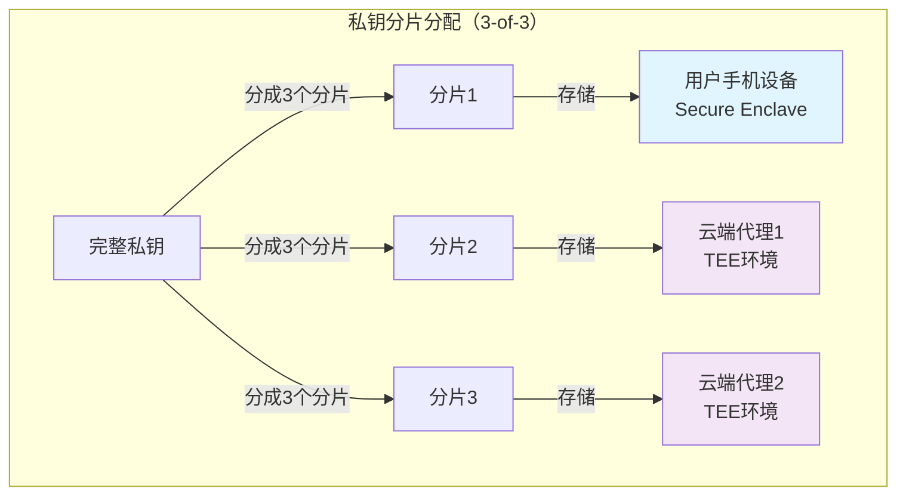
```mermaid
graph TB
    subgraph "私钥分片分配（3-of-3）"
        A[完整私钥] -->|分成3个分片| B[分片1]
        A -->|分成3个分片| C[分片2]
        A -->|分成3个分片| D[分片3]
        
        B -->|存储| E[用户手机设备<br/>Secure Enclave]
        C -->|存储| F[云端代理1<br/>TEE环境]
        D -->|存储| G[云端代理2<br/>TEE环境]
    end
    
    style E fill:#e1f5fe
    style F fill:#f3e5f5
    style G fill:#f3e5f5
```

**分片存储位置**：

| 分片 | 存储位置 | 安全保护 | 控制方 |
|------|---------|---------|--------|
| **分片1** | 用户手机设备 | Secure Enclave/TrustZone<br/>生物认证保护 | 用户本人 |
| **分片2** | 云端代理1 | TEE环境<br/>加密存储<br/>多区域备份 | 服务提供商 |
| **分片3** | 云端代理2 | TEE环境<br/>加密存储<br/>多区域备份 | 服务提供商 |

**关键特点**：
- ✅ **用户持有 1 个分片**：这是您对资产的控制权
- ✅ **需要 3 个分片全部参与**：才能完成签名，任何一方都无法单独控制资产
- ✅ **密钥永不完整存在**：任何单一环境都无法获得完整私钥

#### 2.1.2 团队用户：灵活配置模式

**重要概念区分**：
- **密钥分片（技术层面）**：用于MPC签名，多个分片协作完成签名
- **团队审批（业务层面）**：用于多签策略，需要多个团队成员批准

**⚠️ 企业用户安全要求**：
- ✅ **企业用户必须控制至少1个密钥分片**：确保资产控制权
- ✅ **推荐部署Client Signer**：企业用户的最佳实践
- ⚠️ **不推荐所有分片都在服务提供商云端**：企业用户应避免此配置

团队钱包支持多种密钥分片分配模式，企业可根据需求选择：

---

**模式一：部署Client Signer（企业推荐）**

**适用场景**：
- ✅ 企业用户（强烈推荐）
- ✅ 需要程序化签名（批量操作、自动化流程）
- ✅ 需要7x24小时服务
- ✅ 需要与业务系统集成

**密钥分片分配（3-of-3模式）**：
```
密钥分片分配（3个分片）：
├── 分片1：Client Signer服务器
│   ├── 部署在您的服务器环境中
│   ├── 加密存储在TEE环境或HSM中
│   └── 由您控制和管理（企业持有）
├── 分片2：云端代理1
│   ├── 加密存储在云端TEE环境
│   ├── 多区域备份
│   └── 服务提供商管理
└── 分片3：云端代理2
    ├── 加密存储在另一个云端TEE环境
    ├── 多区域备份
    └── 服务提供商管理
```

**优势**：
- ✅ **企业控制1个分片**：确保资产控制权，符合企业安全要求
- ✅ **程序化签名**：支持自动化流程，提高效率
- ✅ **高可用性**：可以部署多个Client Signer实例
- ✅ **灵活配置**：可以配置自动批准规则

**劣势**：
- ⚠️ 需要部署和维护Client Signer服务
- ⚠️ 需要配置和管理密钥访问权限

---

**模式二：每个团队成员一个分片（M-of-N阈值模式）**

**适用场景**：
- ✅ 中小团队（3-20人）
- ✅ 需要每个成员都持有分片
- ✅ 需要灵活的阈值配置（不需要所有成员参与）
- ✅ 强调去中心化和成员控制
- ✅ 支持容错（部分成员缺席仍可签名）

**密钥分片分配（M-of-N阈值模式）**：
```
密钥分片分配（N个分片，N=团队成员数，M=阈值）：
├── 分片1：团队成员1的设备
│   ├── 存储在Secure Enclave/TrustZone
│   ├── 生物认证保护
│   └── 由成员1控制
├── 分片2：团队成员2的设备
│   ├── 存储在Secure Enclave/TrustZone
│   ├── 生物认证保护
│   └── 由成员2控制
├── 分片3：团队成员3的设备
│   └── ...
└── 分片N：团队成员N的设备
    └── ...
```

**阈值模式说明**：
- **M-of-N**：需要M个分片参与签名，N是总分片数
- **示例**：
  - **5-of-3**：5个成员，需要3个成员参与即可签名
  - **5-of-4**：5个成员，需要4个成员参与即可签名
  - **5-of-5**：5个成员，需要所有5个成员参与（等同于N-of-N）
  - **10-of-7**：10个成员，需要7个成员参与即可签名

**示例一：5人团队，5-of-3模式（推荐）**
```
场景：团队有5个成员，需要3个成员批准即可签名

密钥分片分配（5个分片）：
├── 分片1：Manager 1的设备持有
├── 分片2：Manager 2的设备持有
├── 分片3：Manager 3的设备持有
├── 分片4：Manager 4的设备持有
└── 分片5：Manager 5的设备持有

签名流程：
1. 业务层面：任意3个成员通过APP批准（记录到数据库）
2. 技术层面：这3个成员设备参与MPC签名（每个设备使用自己的分片）
3. 只需要3个分片参与即可完成签名（容错：2个成员缺席仍可签名）

优势：
- ✅ 灵活性高：不需要所有成员参与
- ✅ 容错性强：部分成员缺席仍可签名
- ✅ 适合中等团队：5-10人团队推荐
```

**示例二：5人团队，5-of-4模式**
```
场景：团队有5个成员，需要4个成员批准才能签名

密钥分片分配（5个分片）：
├── 分片1：Manager 1的设备持有
├── 分片2：Manager 2的设备持有
├── 分片3：Manager 3的设备持有
├── 分片4：Manager 4的设备持有
└── 分片5：Manager 5的设备持有

签名流程：
1. 业务层面：任意4个成员通过APP批准（记录到数据库）
2. 技术层面：这4个成员设备参与MPC签名
3. 只需要4个分片参与即可完成签名（容错：1个成员缺席仍可签名）

优势：
- ✅ 安全性高：需要大部分成员参与
- ✅ 容错性强：1个成员缺席仍可签名
- ✅ 适合重要决策场景
```

**示例三：5人团队，5-of-5模式（N-of-N）**
```
场景：团队有5个成员，需要所有5个成员都批准才能签名

密钥分片分配（5个分片）：
├── 分片1：Manager 1的设备持有
├── 分片2：Manager 2的设备持有
├── 分片3：Manager 3的设备持有
├── 分片4：Manager 4的设备持有
└── 分片5：Manager 5的设备持有

签名流程：
1. 业务层面：所有5个成员通过APP批准（记录到数据库）
2. 技术层面：所有5个成员设备参与MPC签名
3. 需要所有5个分片参与才能完成签名

优势：
- ✅ 安全性极高：需要所有成员参与
- ⚠️ 灵活性低：任何成员缺席都无法签名
- ✅ 适合关键决策场景
```

**阈值选择建议**：
- **小团队（3-5人）**：推荐 M-of-N，其中 M = N-1 或 M = N
  - 例如：3-of-3（需要所有人）或 2-of-3（容错1人）
- **中等团队（5-10人）**：推荐 M-of-N，其中 M = N-2 或 M = N-1
  - 例如：5-of-7（容错2人）或 6-of-7（容错1人）
- **大团队（10-20人）**：推荐 M-of-N，其中 M = N-3 或 M = N-2
  - 例如：7-of-10（容错3人）或 8-of-10（容错2人）

**优势**：
- ✅ **完全去中心化**：每个成员都持有分片，无单点故障
- ✅ **成员控制**：每个成员都有资产控制权
- ✅ **灵活阈值**：可根据团队规模和安全需求选择阈值
- ✅ **容错性强**：部分成员缺席仍可签名（取决于阈值配置）
- ✅ **符合MPC理念**：真正的多方控制
- ✅ **适合不同规模团队**：从3人到20人都适用

**劣势**：
- ⚠️ **恢复复杂**：成员离职或设备丢失需要重新分配分片
- ⚠️ **不适合超大团队**：成员数量超过20人时，协调困难
- ⚠️ **不适合自动化**：无法实现程序化签名

**适用建议**：
- ✅ 中小团队（3-20人）
- ✅ 需要灵活阈值配置的场景
- ✅ 强调去中心化和成员控制的场景
- ✅ 需要容错能力的场景（部分成员缺席仍可签名）
- ❌ 不适合需要自动化或批量操作的场景
- ❌ 不适合超大团队（>20人）

---

**模式三：所有分片在云端（不推荐企业使用）**

**适用场景**：
- ⚠️ **仅适用于个人用户或小型团队**
- ⚠️ **不推荐企业用户使用**
- ⚠️ **存在资产控制风险**

**密钥分片分配（3-of-3模式）**：
```
密钥分片分配（3个分片）：
├── 分片1：云端代理1
│   ├── 加密存储在云端TEE环境
│   ├── 多区域备份
│   └── 服务提供商管理
├── 分片2：云端代理2
│   ├── 加密存储在另一个云端TEE环境
│   ├── 多区域备份
│   └── 服务提供商管理
└── 分片3：云端代理3
    ├── 加密存储在第三个云端TEE环境
    ├── 多区域备份
    └── 服务提供商管理
```

**⚠️ 安全风险警告**：
- ❌ **企业用户不应使用此模式**：所有分片都在服务提供商云端，企业失去资产控制权
- ❌ **失去MPC意义**：如果所有分片都由服务提供商控制，企业资产实际上由服务提供商掌握
- ❌ **合规风险**：不符合企业安全合规要求
- ❌ **单点故障风险**：虽然分片分布在不同的云端环境，但都在服务提供商控制下

**适用建议**：
- ✅ 仅适用于个人用户或小型团队（非企业场景）
- ✅ 适合简单场景，无需复杂配置
- ❌ **企业用户必须避免此配置**

---

**模式对比总结**：

| 特性 | 模式一：Client Signer | 模式二：M-of-N阈值 | 模式三：全云端 |
|------|---------------------|------------------|--------------|
| **企业适用性** | ✅ 强烈推荐 | ⚠️ 中小团队适用 | ❌ 不推荐 |
| **资产控制权** | ✅ 企业控制1个分片 | ✅ 成员控制所有分片 | ❌ 企业无控制权 |
| **自动化支持** | ✅ 支持程序化签名 | ❌ 不支持 | ⚠️ 有限支持 |
| **灵活性** | ✅ 高 | ✅ 高（可配置阈值） | ✅ 高 |
| **容错能力** | ✅ 高（3-of-3） | ✅ 高（可配置，如5-of-3） | ✅ 高（3-of-3） |
| **部署复杂度** | ⚠️ 需要部署Client Signer | ✅ 无需部署 | ✅ 无需部署 |
| **恢复复杂度** | ✅ 简单 | ⚠️ 复杂（需重新分配） | ✅ 简单 |
| **安全性** | ✅ 高 | ✅ 极高 | ⚠️ 中等（企业风险高） |
| **适用团队规模** | 任意规模 | 3-20人 | 个人/小团队 |

---

**关键说明**：
- ✅ **密钥分片分配是技术层面的**：用于MPC签名，多个分片协作完成签名
- ✅ **团队审批是业务层面实现**：
  - 通过数据库和业务逻辑实现
  - 团队成员通过APP批准，记录在数据库中
  - 达到审批阈值后，触发MPC签名流程（技术层面）
- ✅ **两个层面独立工作**：
  - **业务层面**：团队审批（需要多少个团队成员批准）- 通过数据库实现
  - **技术层面**：MPC签名（需要多个密钥分片参与）- 通过MPC协议实现

**示例说明**：

**示例一：模式一（部署Client Signer）**
```
场景：企业团队钱包需要2个Manager批准才能转账

业务层面（团队审批 - 通过数据库实现）：
- Manager 1：通过APP批准 → 记录到数据库
- Manager 2：通过APP批准 → 记录到数据库
- 系统检查：达到2个批准阈值 → 触发MPC签名流程

技术层面（密钥分片 - 通过MPC协议实现）：
- 分片1：Client Signer持有（企业服务器）
- 分片2：云端代理1持有
- 分片3：云端代理2持有
- 3个分片协作完成MPC签名
```

**示例二：模式二（M-of-N阈值模式，5人团队）**

**场景A：5-of-3模式（推荐）**
```
场景：5人团队，需要3个成员批准即可转账

业务层面（团队审批 - 通过数据库实现）：
- Manager 1：通过APP批准 → 记录到数据库
- Manager 2：通过APP批准 → 记录到数据库
- Manager 3：通过APP批准 → 记录到数据库
- 系统检查：达到3个批准阈值 → 触发MPC签名流程
- （Manager 4和Manager 5未参与，但签名仍可完成）

技术层面（密钥分片 - 通过MPC协议实现）：
- 分片1：Manager 1的设备持有（参与签名）
- 分片2：Manager 2的设备持有（参与签名）
- 分片3：Manager 3的设备持有（参与签名）
- 分片4：Manager 4的设备持有（未参与）
- 分片5：Manager 5的设备持有（未参与）
- 3个分片协作完成MPC签名（只需要3个分片参与，容错2人）
```

**场景B：5-of-4模式**
```
场景：5人团队，需要4个成员批准才能转账

业务层面（团队审批 - 通过数据库实现）：
- Manager 1：通过APP批准 → 记录到数据库
- Manager 2：通过APP批准 → 记录到数据库
- Manager 3：通过APP批准 → 记录到数据库
- Manager 4：通过APP批准 → 记录到数据库
- 系统检查：达到4个批准阈值 → 触发MPC签名流程
- （Manager 5未参与，但签名仍可完成）

技术层面（密钥分片 - 通过MPC协议实现）：
- 分片1：Manager 1的设备持有（参与签名）
- 分片2：Manager 2的设备持有（参与签名）
- 分片3：Manager 3的设备持有（参与签名）
- 分片4：Manager 4的设备持有（参与签名）
- 分片5：Manager 5的设备持有（未参与）
- 4个分片协作完成MPC签名（只需要4个分片参与，容错1人）
```

**场景C：5-of-5模式（N-of-N）**
```
场景：5人团队，需要所有5个成员批准才能转账

业务层面（团队审批 - 通过数据库实现）：
- Manager 1：通过APP批准 → 记录到数据库
- Manager 2：通过APP批准 → 记录到数据库
- Manager 3：通过APP批准 → 记录到数据库
- Manager 4：通过APP批准 → 记录到数据库
- Manager 5：通过APP批准 → 记录到数据库
- 系统检查：达到5个批准阈值 → 触发MPC签名流程

技术层面（密钥分片 - 通过MPC协议实现）：
- 分片1：Manager 1的设备持有（参与签名）
- 分片2：Manager 2的设备持有（参与签名）
- 分片3：Manager 3的设备持有（参与签名）
- 分片4：Manager 4的设备持有（参与签名）
- 分片5：Manager 5的设备持有（参与签名）
- 5个分片协作完成MPC签名（需要所有5个分片参与，无容错）
```

**重要理解**：
- ⚠️ **审批是业务层面**：通过数据库记录审批状态，不涉及密钥分片
- ⚠️ **签名是技术层面**：通过MPC协议，多个密钥分片协作完成
- ✅ **两个层面完全独立**：审批通过后，才启动MPC签名流程
- ✅ **企业用户必须控制至少1个分片**：确保资产控制权
- ⚠️ **不推荐企业用户使用全云端模式**：存在资产控制风险

### 2.2 签名流程与协作关系

#### 2.2.1 个人用户签名流程

当您发起一笔转账时，三个分片需要协作完成签名：

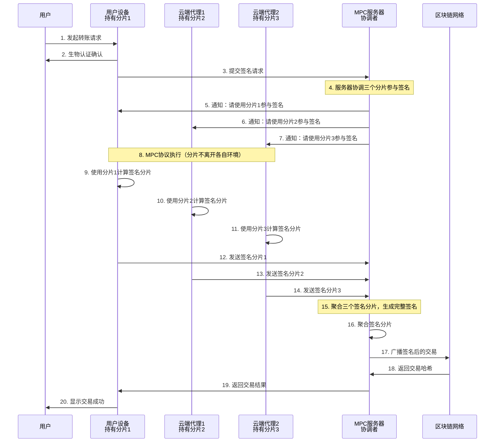
```mermaid
sequenceDiagram
    participant User as 用户
    participant Device as 用户设备<br/>持有分片1
    participant Proxy1 as 云端代理1<br/>持有分片2
    participant Proxy2 as 云端代理2<br/>持有分片3
    participant Server as MPC服务器<br/>协调者
    participant Blockchain as 区块链网络

    User->>Device: 1. 发起转账请求
    Device->>User: 2. 生物认证确认
    Device->>Server: 3. 提交签名请求
    
    Note over Server: 4. 服务器协调三个分片参与签名
    
    Server->>Device: 5. 通知：请使用分片1参与签名
    Server->>Proxy1: 6. 通知：请使用分片2参与签名
    Server->>Proxy2: 7. 通知：请使用分片3参与签名
    
    Note over Device,Proxy2: 8. MPC协议执行（分片不离开各自环境）
    
    Device->>Device: 9. 使用分片1计算签名分片
    Proxy1->>Proxy1: 10. 使用分片2计算签名分片
    Proxy2->>Proxy2: 11. 使用分片3计算签名分片
    
    Device->>Server: 12. 发送签名分片1
    Proxy1->>Server: 13. 发送签名分片2
    Proxy2->>Server: 14. 发送签名分片3
    
    Note over Server: 15. 聚合三个签名分片，生成完整签名
    
    Server->>Server: 16. 聚合签名分片
    Server->>Blockchain: 17. 广播签名后的交易
    Blockchain->>Server: 18. 返回交易哈希
    Server->>Device: 19. 返回交易结果
    Device->>User: 20. 显示交易成功
```

**关键步骤说明**：

1. **用户发起请求**：您在APP中输入转账信息并确认
2. **生物认证**：您的设备验证身份（FaceID/TouchID/指纹）
3. **服务器协调**：MPC服务器通知三个分片持有方参与签名
4. **分片计算**：每个分片在自己的安全环境中独立计算签名分片
   - ⚠️ **重要**：分片永不离开各自的安全环境
   - ⚠️ **重要**：任何一方都无法看到其他分片的内容
5. **签名聚合**：服务器收集三个签名分片，聚合生成完整签名
6. **交易广播**：将签名后的交易广播到区块链网络

#### 2.2.2 协作关系图

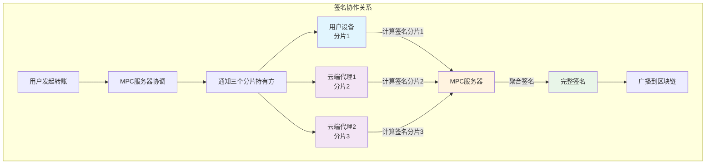
```mermaid
graph TB
    subgraph "签名协作关系"
        A[用户发起转账] --> B[MPC服务器协调]
        B --> C[通知三个分片持有方]
        
        C --> D[用户设备<br/>分片1]
        C --> E[云端代理1<br/>分片2]
        C --> F[云端代理2<br/>分片3]
        
        D -->|计算签名分片1| G[MPC服务器]
        E -->|计算签名分片2| G
        F -->|计算签名分片3| G
        
        G -->|聚合签名| H[完整签名]
        H --> I[广播到区块链]
    end
    
    style D fill:#e1f5fe
    style E fill:#f3e5f5
    style F fill:#f3e5f5
    style G fill:#fff3e0
    style H fill:#e8f5e8
```

**协作特点**：

| 特点 | 说明 |
|------|------|
| **分布式计算** | 每个分片在自己的环境中独立计算，不共享分片内容 |
| **服务器协调** | MPC服务器只负责协调和聚合，不持有任何分片 |
| **安全隔离** | 分片之间互不可见，无法单独重构私钥 |
| **需要全部参与** | 3-of-3 模式需要三个分片全部参与才能签名 |

#### 2.2.3 团队钱包签名流程

团队钱包的签名流程包含两个层面：**业务审批层**和**技术签名层**。

**情况一：部署了Client Signer**

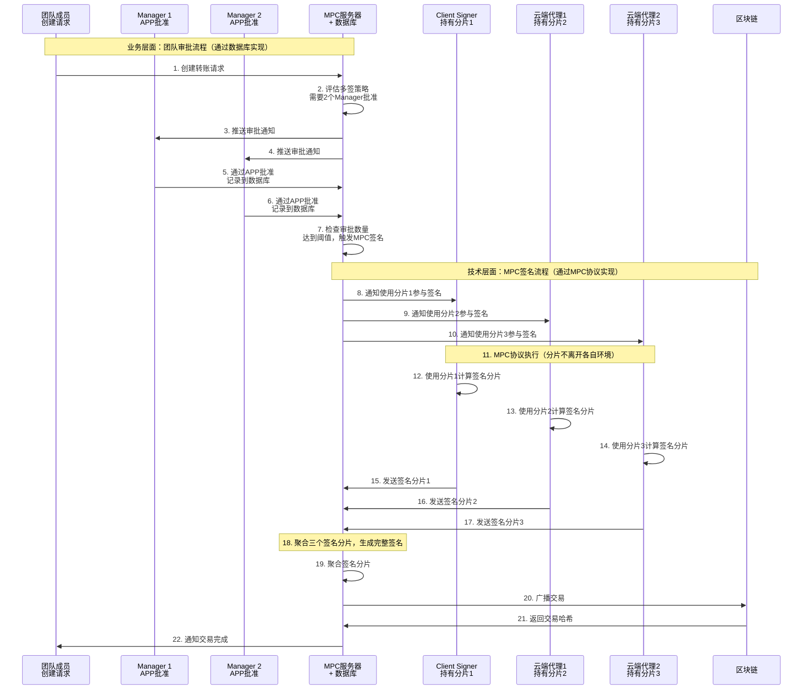
```mermaid
sequenceDiagram
    participant Member as 团队成员<br/>创建请求
    participant Manager1 as Manager 1<br/>APP批准
    participant Manager2 as Manager 2<br/>APP批准
    participant Server as MPC服务器<br/>+ 数据库
    participant Signer as Client Signer<br/>持有分片1
    participant Proxy1 as 云端代理1<br/>持有分片2
    participant Proxy2 as 云端代理2<br/>持有分片3
    participant Blockchain as 区块链

    Note over Member,Server: 业务层面：团队审批流程（通过数据库实现）
    
    Member->>Server: 1. 创建转账请求
    Server->>Server: 2. 评估多签策略<br/>需要2个Manager批准
    Server->>Manager1: 3. 推送审批通知
    Server->>Manager2: 4. 推送审批通知
    Manager1->>Server: 5. 通过APP批准<br/>记录到数据库
    Manager2->>Server: 6. 通过APP批准<br/>记录到数据库
    Server->>Server: 7. 检查审批数量<br/>达到阈值，触发MPC签名
    
    Note over Server,Blockchain: 技术层面：MPC签名流程（通过MPC协议实现）
    
    Server->>Signer: 8. 通知使用分片1参与签名
    Server->>Proxy1: 9. 通知使用分片2参与签名
    Server->>Proxy2: 10. 通知使用分片3参与签名
    
    Note over Signer,Proxy2: 11. MPC协议执行（分片不离开各自环境）
    
    Signer->>Signer: 12. 使用分片1计算签名分片
    Proxy1->>Proxy1: 13. 使用分片2计算签名分片
    Proxy2->>Proxy2: 14. 使用分片3计算签名分片
    
    Signer->>Server: 15. 发送签名分片1
    Proxy1->>Server: 16. 发送签名分片2
    Proxy2->>Server: 17. 发送签名分片3
    
    Note over Server: 18. 聚合三个签名分片，生成完整签名
    
    Server->>Server: 19. 聚合签名分片
    Server->>Blockchain: 20. 广播交易
    Blockchain->>Server: 21. 返回交易哈希
    Server->>Member: 22. 通知交易完成
```

**情况二：未部署Client Signer**

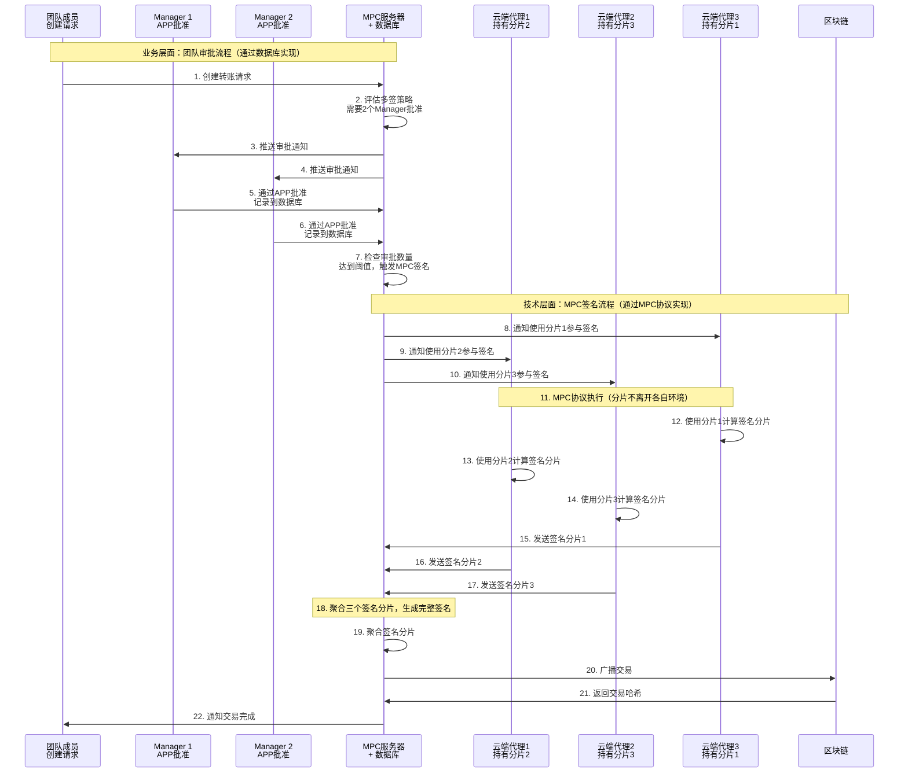
```mermaid
sequenceDiagram
    participant Member as 团队成员<br/>创建请求
    participant Manager1 as Manager 1<br/>APP批准
    participant Manager2 as Manager 2<br/>APP批准
    participant Server as MPC服务器<br/>+ 数据库
    participant Proxy1 as 云端代理1<br/>持有分片2
    participant Proxy2 as 云端代理2<br/>持有分片3
    participant Proxy3 as 云端代理3<br/>持有分片1
    participant Blockchain as 区块链

    Note over Member,Server: 业务层面：团队审批流程（通过数据库实现）
    
    Member->>Server: 1. 创建转账请求
    Server->>Server: 2. 评估多签策略<br/>需要2个Manager批准
    Server->>Manager1: 3. 推送审批通知
    Server->>Manager2: 4. 推送审批通知
    Manager1->>Server: 5. 通过APP批准<br/>记录到数据库
    Manager2->>Server: 6. 通过APP批准<br/>记录到数据库
    Server->>Server: 7. 检查审批数量<br/>达到阈值，触发MPC签名
    
    Note over Server,Blockchain: 技术层面：MPC签名流程（通过MPC协议实现）
    
    Server->>Proxy3: 8. 通知使用分片1参与签名
    Server->>Proxy1: 9. 通知使用分片2参与签名
    Server->>Proxy2: 10. 通知使用分片3参与签名
    
    Note over Proxy1,Proxy3: 11. MPC协议执行（分片不离开各自环境）
    
    Proxy3->>Proxy3: 12. 使用分片1计算签名分片
    Proxy1->>Proxy1: 13. 使用分片2计算签名分片
    Proxy2->>Proxy2: 14. 使用分片3计算签名分片
    
    Proxy3->>Server: 15. 发送签名分片1
    Proxy1->>Server: 16. 发送签名分片2
    Proxy2->>Server: 17. 发送签名分片3
    
    Note over Server: 18. 聚合三个签名分片，生成完整签名
    
    Server->>Server: 19. 聚合签名分片
    Server->>Blockchain: 20. 广播交易
    Blockchain->>Server: 21. 返回交易哈希
    Server->>Member: 22. 通知交易完成
```

**关键理解**：

1. **两个层面独立工作**：
   - **业务层面（团队审批）**：通过数据库和业务逻辑实现
     - 团队成员通过APP批准，记录到数据库
     - 系统检查审批数量，达到阈值后触发MPC签名
     - 不涉及密钥分片，纯粹是业务逻辑
   - **技术层面（MPC签名）**：通过MPC协议实现
     - 需要3个密钥分片协作完成签名
     - 分片存储在固定位置，不随团队成员变化

2. **分片持有者（技术层面，固定不变）**：
   - **如果部署了Client Signer**：
     - 分片1：Client Signer服务器持有
     - 分片2：云端代理1持有
     - 分片3：云端代理2持有
   - **如果未部署Client Signer**：
     - 分片1：云端代理3持有（第三个云端环境）
     - 分片2：云端代理1持有
     - 分片3：云端代理2持有
   - ⚠️ **重要**：分片不存储在团队成员设备中

3. **审批和签名的关系**：
   - **步骤1**：团队成员通过APP批准（业务层面，记录到数据库）
   - **步骤2**：系统检查审批数量，达到阈值后触发MPC签名（技术层面）
   - **步骤3**：3个密钥分片协作完成签名（技术层面）

4. **常见误解澄清**：
   - ❌ **误解**：每个团队成员都持有密钥分片
   - ✅ **正确**：密钥分片只有3个，存储在固定位置（Client Signer或云端代理）
   - ✅ **正确**：团队成员通过APP批准，这是业务层面的审批，不涉及密钥分片
   - ✅ **正确**：审批通过数据库实现，签名通过MPC协议实现，两者完全独立

#### 2.2.4 安全保证

**为什么这样设计是安全的？**

1. **密钥永不完整存在**
   - 完整私钥从未在任何地方完整存在
   - 即使某个环境被完全攻破，攻击者也只能获得 1 个分片
   - 需要 3 个分片才能签名，攻击者无法单独控制资产

2. **分片隔离保护**
   - 每个分片存储在不同的安全环境中
   - 分片之间互不可见，无法相互验证
   - 即使一个环境被攻击，其他环境仍然安全

3. **协作签名机制**
   - 签名时，分片不离开各自的安全环境
   - 每个分片只计算自己的签名分片
   - 服务器只负责聚合，无法获得完整私钥

### 2.3 与传统钱包的对比

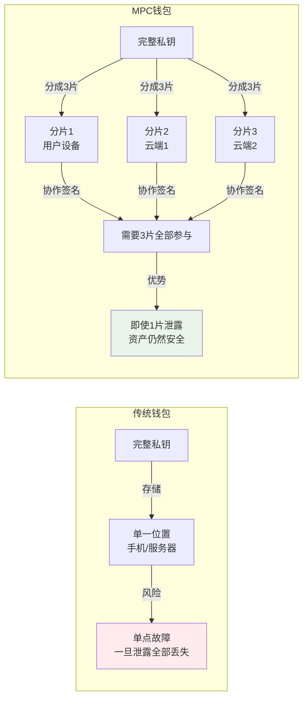
```mermaid
graph LR
    subgraph "传统钱包"
        A1[完整私钥] -->|存储| B1[单一位置<br/>手机/服务器]
        B1 -->|风险| C1[单点故障<br/>一旦泄露全部丢失]
    end
    
    subgraph "MPC钱包"
        A2[完整私钥] -->|分成3片| B2[分片1<br/>用户设备]
        A2 -->|分成3片| B3[分片2<br/>云端1]
        A2 -->|分成3片| B4[分片3<br/>云端2]
        B2 -->|协作签名| D2[需要3片全部参与]
        B3 -->|协作签名| D2
        B4 -->|协作签名| D2
        D2 -->|优势| E2[即使1片泄露<br/>资产仍然安全]
    end
    
    style C1 fill:#ffebee
    style E2 fill:#e8f5e8
```

**对比总结**：

| 特性 | 传统钱包 | MPC钱包 |
|------|---------|---------|
| **私钥存储** | 完整存储在单一位置 | 分成3片，存储在3个不同环境 |
| **单点故障** | 存在，一旦泄露全部丢失 | 消除，即使1片泄露仍安全 |
| **用户控制** | 完全依赖单一设备 | 用户持有1片，保持控制权 |
| **恢复能力** | 依赖备份，恢复复杂 | 多片备份，恢复灵活 |
| **安全性** | 集中式风险 | 分布式安全 |

---

### 2.4 Passkey 鉴权与 2-of-3 方案

为提升用户体验与安全防护，系统支持采用 Passkey（WebAuthn）作为用户授权凭证，并引入 2-of-3 Delegated Guardian 架构。该方案将复杂的 MPC 计算下沉到云端，由“运营方 (Operator)”与“鉴权代理 (Guardian)”协同完成，用户侧以 Passkey 进行轻量签名授权。

参考设计文档：`docs/design/2_of_3_delegated_guardian.md`

#### 2.4.1 注册绑定

首次使用时，用户在本地设备完成 Passkey 注册，生成 `credential_id` 与 `public_key (COSE)`，并与钱包策略绑定。

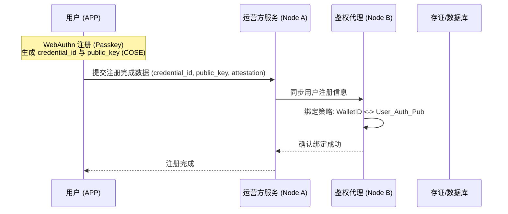
```mermaid
sequenceDiagram
    participant User as 用户 (APP)
    participant Operator as 运营方服务 (Node A)
    participant Guardian as 鉴权代理 (Node B)
    participant Chain as 存证/数据库

    Note over User: WebAuthn 注册 (Passkey)<br/>生成 credential_id 与 public_key (COSE)
    User->>Operator: 提交注册完成数据 (credential_id, public_key, attestation)
    Operator->>Guardian: 同步用户注册信息
    Guardian->>Guardian: 绑定策略: WalletID <-> User_Auth_Pub
    Guardian-->>Operator: 确认绑定成功
    Operator-->>User: 注册完成
```

关键点：
- 用户侧仅保存 Passkey 私钥，存放于设备安全硬件（Secure Enclave/KeyStore）
- Guardian 自此只接受该用户公钥签名的授权指令

#### 2.4.2 新版个人签名流程

用户在 APP 上对交易挑战（如 `TxHash/Nonce`）进行 Passkey 轻量签名，随后由 Operator 与 Guardian 在云端完成 2-of-3 MPC 计算并广播交易。

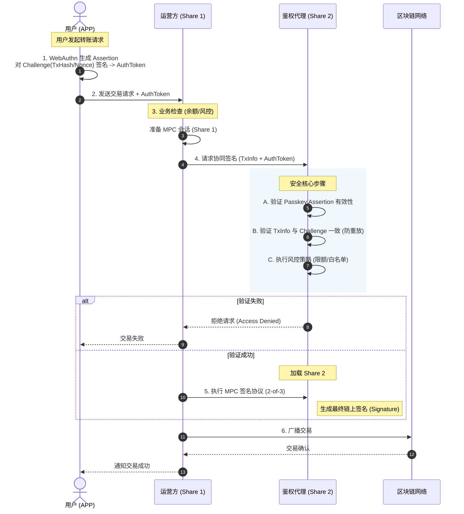
```mermaid
sequenceDiagram
    autonumber
    actor User as 用户 (APP)
    participant Operator as 运营方 (Share 1)
    participant Guardian as 鉴权代理 (Share 2)
    participant Network as 区块链网络

    Note over User: 用户发起转账请求
    User->>User: 1. WebAuthn 生成 Assertion<br/>对 Challenge(TxHash/Nonce) 签名 -> AuthToken
    User->>Operator: 2. 发送交易请求 + AuthToken

    Note over Operator: 3. 业务检查 (余额/风控)
    Operator->>Operator: 准备 MPC 会话 (Share 1)

    Operator->>Guardian: 4. 请求协同签名 (TxInfo + AuthToken)
    rect rgb(240, 248, 255)
        Note over Guardian: 安全核心步骤
        Guardian->>Guardian: A. 验证 Passkey Assertion 有效性
        Guardian->>Guardian: B. 验证 TxInfo 与 Challenge 一致 (防重放)
        Guardian->>Guardian: C. 执行风控策略 (限额/白名单)
    end

    alt 验证失败
        Guardian-->>Operator: 拒绝请求 (Access Denied)
        Operator-->>User: 交易失败
    else 验证成功
        Note over Guardian: 加载 Share 2
        Operator->>Guardian: 5. 执行 MPC 签名协议 (2-of-3)
        Note right of Guardian: 生成最终链上签名 (Signature)
    end

    Operator->>Network: 6. 广播交易
    Network-->>Operator: 交易确认
    Operator-->>User: 通知交易成功
```

用户体验：
- 所见即所签：APP 展示交易详情，Passkey 绑定 `origin` 与挑战内容
- 轻量授权：用户只需完成一次设备级生物认证（FaceID/指纹）

#### 2.4.3 团队多签（链下聚合）

在 Delegated Guardian 架构下，实现团队审批无需链上多签合约。Guardian 收集多个成员的 Passkey 授权后再参与 MPC。

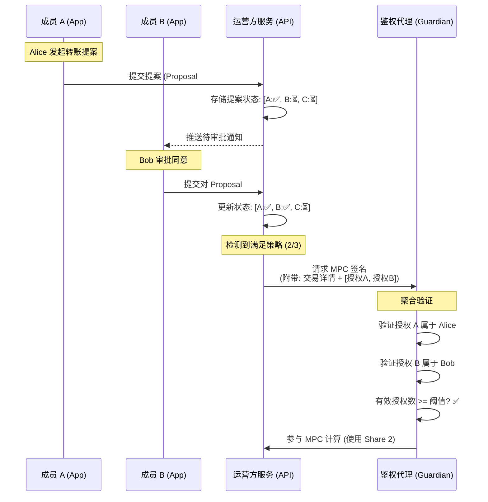
```mermaid
sequenceDiagram
    participant Alice as 成员 A (App)
    participant Bob as 成员 B (App)
    participant Operator as 运营方服务 (API)
    participant Guardian as 鉴权代理 (Guardian)

    Note over Alice: Alice 发起转账提案
    Alice->>Operator: 提交提案 (Proposal #101) + 授权 A
    Operator->>Operator: 存储提案状态: [A:✅, B:⏳, C:⏳]
    Operator-->>Bob: 推送待审批通知

    Note over Bob: Bob 审批同意
    Bob->>Operator: 提交对 Proposal #101 的授权 B
    Operator->>Operator: 更新状态: [A:✅, B:✅, C:⏳]

    Note over Operator: 检测到满足策略 (2/3)
    Operator->>Guardian: 请求 MPC 签名<br/>(附带: 交易详情 + [授权A, 授权B])

    Note over Guardian: 聚合验证
    Guardian->>Guardian: 验证授权 A 属于 Alice
    Guardian->>Guardian: 验证授权 B 属于 Bob
    Guardian->>Guardian: 有效授权数 >= 阈值? ✅

    Guardian->>Operator: 参与 MPC 计算 (使用 Share 2)
```

优势：
- 零 Gas 成本：多人审批逻辑在链下完成
- 灵活配置：可随时更换成员与阈值，无需迁移资产

#### 2.4.4 灾难恢复

当用户设备或运营方节点出现故障时，通过冷备份分片（Share 3）执行重分片恢复。

```mermaid
flowchart TD
    Start((开始恢复)) --> Check[故障类型判断]
    Check -->|用户手机/私钥丢失| UserLost
    Check -->|运营方数据丢失| OperatorLost

    subgraph UserRecovery [用户端恢复]
        UserLost[用户发起重置请求] --> KYC[严格身份认证]
        KYC --> Admin[管理员介入]
        Admin --> Retrieve3[取出 Share 3]
        Retrieve3 --> Reshare[执行 MPC Reshare]
        Reshare --> NewShares[生成新 Share 1/2/3]
        NewShares --> BindNew[绑定新设备 Passkey]
        BindNew --> Finish1((恢复完成))
    end

    subgraph SysRecovery [系统恢复]
        OperatorLost[启用灾备预案] --> Retrieve3_Sys[取出 Share 3]
        Retrieve3_Sys --> Combine[Node B (Share 2) and Share 3]
        Combine --> Reshare_Sys[执行 MPC Reshare]
        Reshare_Sys --> Restore[恢复服务]
        Restore --> Finish2((恢复完成))
    end
```

安全说明：
- 运营方无法单方作恶：Guardian 强制验证用户 Passkey 授权
- 建议将 Guardian 部署在 TEE，以保证分片与验证逻辑的完整性

## 3. 核心价值

### 2.1 安全价值

**传统钱包 vs MPC 钱包**：

| 特性 | 传统钱包 | MPC 钱包 |
|------|---------|---------|
| **私钥存储** | 完整存储在单一位置 | 分片存储，永不完整存在 |
| **单点故障** | 存在风险 | 完全消除 |
| **攻击面** | 集中式，风险高 | 分布式，风险低 |
| **合规性** | 难以满足 | 满足金融级要求 |

### 2.2 业务价值

**对于个人用户**：
- ✅ 资产安全：即使设备丢失，资产仍然安全
- ✅ 便捷使用：支持移动APP，随时随地管理资产
- ✅ 多链统一：一个钱包管理所有区块链资产

**对于团队用户**：
- ✅ 多签审批：灵活的审批流程，满足内控要求
- ✅ 批量操作：支持批量转账、工资发放、空投等
- ✅ 审计追踪：完整的操作记录，满足合规要求
- ✅ 权限管理：细粒度的角色和权限控制

### 2.3 技术优势

- **零信任架构**：不信任任何单一环境
- **多层防护**：软件、硬件、协议、加密多层保护
- **高可用性**：99.9% 可用性保证
- **高性能**：毫秒级响应，支持高并发

---

## 4. 个人用户使用场景

### 4.1 场景一：创建个人钱包

#### 4.1.1 使用流程

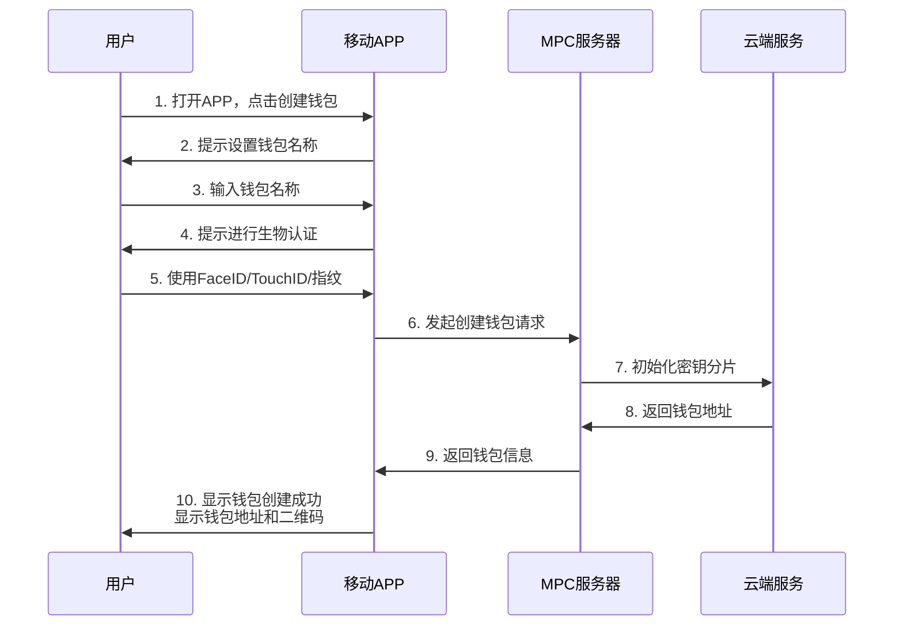
```mermaid
sequenceDiagram
    participant User as 用户
    participant APP as 移动APP
    participant Server as MPC服务器
    participant Cloud as 云端服务

    User->>APP: 1. 打开APP，点击创建钱包
    APP->>User: 2. 提示设置钱包名称
    User->>APP: 3. 输入钱包名称
    APP->>User: 4. 提示进行生物认证
    User->>APP: 5. 使用FaceID/TouchID/指纹
    APP->>Server: 6. 发起创建钱包请求
    Server->>Cloud: 7. 初始化密钥分片
    Cloud->>Server: 8. 返回钱包地址
    Server->>APP: 9. 返回钱包信息
    APP->>User: 10. 显示钱包创建成功<br/>显示钱包地址和二维码
```

#### 5.1.2 详细步骤说明

**步骤 1-2：启动创建流程**
- 用户打开移动APP
- 点击"创建钱包"按钮
- APP显示创建向导

**步骤 3：设置钱包信息**
- 输入钱包名称（可选，用于标识）
- 选择支持的区块链（Bitcoin、Ethereum等）
- 确认创建

**步骤 4-5：安全验证**
- APP提示进行生物认证
- iOS用户：FaceID 或 TouchID
- Android用户：指纹识别或面部识别
- 认证成功后继续

**步骤 6-9：分布式密钥生成（DKG）**
- APP自动与服务器通信，启动DKG协议
- **关键安全机制**：三个参与方各自在自己的环境中独立生成密钥分片
  - **您的手机设备**：在自己的 Secure Enclave/TrustZone 中生成分片1
  - **云端代理1**：在自己的 TEE 环境中生成分片2
  - **云端代理2**：在自己的 TEE 环境中生成分片3
- **重要**：分片在生成过程中就存储在各自的环境中，永不离开
- **重要**：服务器（Coordinator）只负责协调通信，**不接触任何分片**
- 用户无需等待，过程自动化

**步骤 10：完成创建**
- APP显示钱包创建成功
- 显示钱包地址和二维码
- 提示用户备份钱包（建议立即备份）
  - 可以选择备份文件或云端同步
  - 备份文件已加密，安全可靠
- **安全提示**：您的设备已安全存储 1 个密钥分片，这是您对资产的控制权
- **重要**：MPC钱包无法使用传统助记词备份，请使用备份文件或云端同步

#### 4.1.3 用户体验要点

- **简单快捷**：3步完成，无需复杂操作
- **安全可靠**：生物认证保护，密钥分片自动创建
- **即时可用**：创建后立即可以使用
- **友好提示**：清晰的引导和状态提示

### 4.2 场景二：发起转账

#### 4.2.1 使用流程

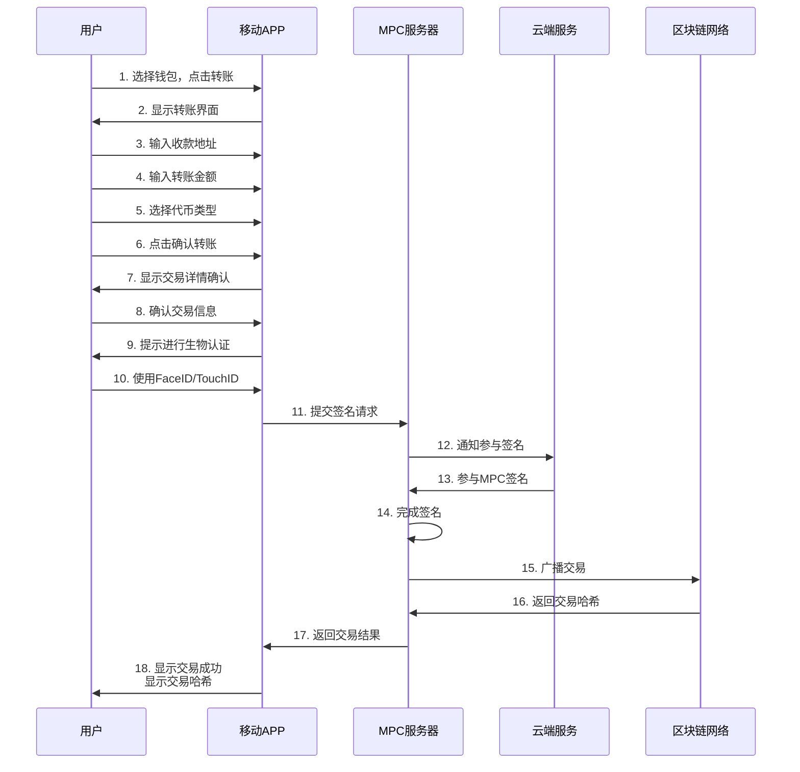
```mermaid
sequenceDiagram
    participant User as 用户
    participant APP as 移动APP
    participant Server as MPC服务器
    participant Cloud as 云端服务
    participant Blockchain as 区块链网络

    User->>APP: 1. 选择钱包，点击转账
    APP->>User: 2. 显示转账界面
    User->>APP: 3. 输入收款地址
    User->>APP: 4. 输入转账金额
    User->>APP: 5. 选择代币类型
    User->>APP: 6. 点击确认转账
    APP->>User: 7. 显示交易详情确认
    User->>APP: 8. 确认交易信息
    APP->>User: 9. 提示进行生物认证
    User->>APP: 10. 使用FaceID/TouchID
    APP->>Server: 11. 提交签名请求
    Server->>Cloud: 12. 通知参与签名
    Cloud->>Server: 13. 参与MPC签名
    Server->>Server: 14. 完成签名
    Server->>Blockchain: 15. 广播交易
    Blockchain->>Server: 16. 返回交易哈希
    Server->>APP: 17. 返回交易结果
    APP->>User: 18. 显示交易成功<br/>显示交易哈希
```

#### 4.2.2 详细步骤说明

**步骤 1-5：输入转账信息**
- 选择要使用的钱包
- 输入或扫描收款地址
- 输入转账金额
- 选择代币类型（USDT、ETH等）
- 可选：添加备注信息

**步骤 6-8：确认交易**
- 点击"确认转账"
- APP显示交易详情摘要：
  - 收款地址
  - 转账金额
  - 手续费估算
  - 预计到账时间
- 用户仔细核对信息

**步骤 9-10：安全验证**
- APP提示进行生物认证
- 用户使用FaceID/TouchID/指纹
- 认证成功后提交

**步骤 11-14：后台签名**
- APP自动提交签名请求
- 服务器协调多方完成签名
- 用户无需等待，过程自动化
- 通常耗时 < 200ms

**步骤 15-18：完成交易**
- 交易自动广播到区块链
- APP显示交易成功
- 显示交易哈希，可点击查看详情
- 提供交易状态追踪链接

#### 4.2.3 用户体验要点

- **操作简单**：5步完成转账，界面清晰
- **安全确认**：交易详情确认 + 生物认证双重保护
- **即时反馈**：实时显示交易状态
- **透明可查**：提供交易哈希和区块链浏览器链接

### 4.3 场景三：接收资产

#### 4.3.1 使用流程

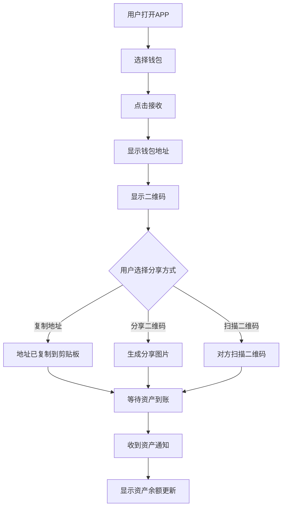
```mermaid
flowchart TD
    A[用户打开APP] --> B[选择钱包]
    B --> C[点击接收]
    C --> D[显示钱包地址]
    D --> E[显示二维码]
    E --> F{用户选择分享方式}
    F -->|复制地址| G[地址已复制到剪贴板]
    F -->|分享二维码| H[生成分享图片]
    F -->|扫描二维码| I[对方扫描二维码]
    G --> J[等待资产到账]
    H --> J
    I --> J
    J --> K[收到资产通知]
    K --> L[显示资产余额更新]
```

#### 4.3.2 详细步骤说明

**步骤 1-3：打开接收界面**
- 用户打开APP，选择钱包
- 点击"接收"按钮
- APP显示接收界面

**步骤 4-5：显示接收信息**
- 显示钱包地址（可复制）
- 显示二维码（可扫描）
- 显示支持的代币类型

**步骤 6-9：分享地址**
- **方式一**：复制地址，粘贴发送给对方
- **方式二**：分享二维码图片
- **方式三**：对方直接扫描二维码

**步骤 10-12：等待到账**
- 用户等待资产到账
- APP自动检测区块链交易
- 收到资产后推送通知
- 显示资产余额更新

#### 4.3.3 用户体验要点

- **多种分享方式**：地址、二维码、图片分享
- **自动检测**：无需手动刷新，自动检测到账
- **及时通知**：到账后立即推送通知
- **清晰展示**：地址和二维码清晰易读

### 4.4 场景四：备份与恢复

#### 4.4.1 备份流程

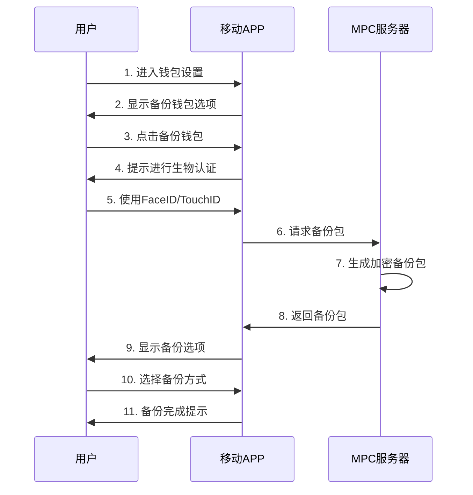
```mermaid
sequenceDiagram
    participant User as 用户
    participant APP as 移动APP
    participant Server as MPC服务器

    User->>APP: 1. 进入钱包设置
    APP->>User: 2. 显示备份钱包选项
    User->>APP: 3. 点击备份钱包
    APP->>User: 4. 提示进行生物认证
    User->>APP: 5. 使用FaceID/TouchID
    APP->>Server: 6. 请求备份包
    Server->>Server: 7. 生成加密备份包
    Server->>APP: 8. 返回备份包
    APP->>User: 9. 显示备份选项
    User->>APP: 10. 选择备份方式
    APP->>User: 11. 备份完成提示
```

#### 4.4.2 恢复流程

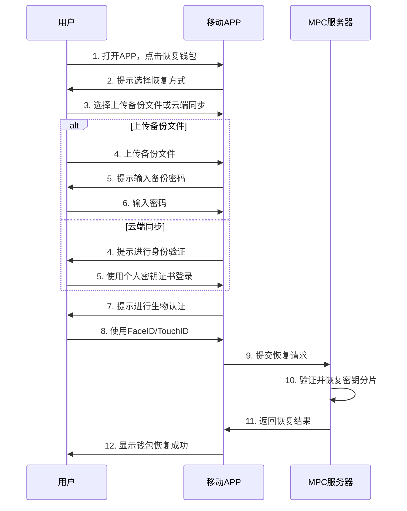
```mermaid
sequenceDiagram
    participant User as 用户
    participant APP as 移动APP
    participant Server as MPC服务器

    User->>APP: 1. 打开APP，点击恢复钱包
    APP->>User: 2. 提示选择恢复方式
    User->>APP: 3. 选择上传备份文件或云端同步
    alt 上传备份文件
        User->>APP: 4. 上传备份文件
        APP->>User: 5. 提示输入备份密码
        User->>APP: 6. 输入密码
    else 云端同步
        APP->>User: 4. 提示进行身份验证
        User->>APP: 5. 使用个人密钥证书登录
    end
    APP->>User: 7. 提示进行生物认证
    User->>APP: 8. 使用FaceID/TouchID
    APP->>Server: 9. 提交恢复请求
    Server->>Server: 10. 验证并恢复密钥分片
    Server->>APP: 11. 返回恢复结果
    APP->>User: 12. 显示钱包恢复成功
```

#### 4.4.3 备份方式说明

**重要说明**：
⚠️ **MPC钱包无法使用传统助记词备份**
- 因为私钥被分成3个分片，永不完整存在
- 无法生成BIP39助记词（助记词对应完整私钥）
- 备份方式与传统钱包不同，但同样安全可靠

**方式一：备份文件（推荐）**
- 系统生成加密备份文件
- 备份文件包含：
  - 加密的密钥分片信息（使用您的Ed25519公钥加密）
  - 钱包元数据
  - 恢复所需的所有信息
- 用户保存到安全位置（云盘、硬件设备、离线存储等）
- 恢复时上传备份文件并输入密码
- **安全提示**：备份文件已加密，即使丢失也不会泄露密钥

**方式二：多设备同步**
- 通过云端安全同步
- 在新设备上登录即可恢复
- 需要身份验证（个人密钥证书）
- 自动同步密钥分片信息
- **优势**：便捷，无需手动管理备份文件

**方式三：个人密钥证书备份（用于身份认证）**
- 个人密钥证书（Ed25519密钥对）可能有助记词
- **注意**：这是用于身份认证的密钥，不是钱包私钥
- 丢失后可以重新生成，不影响钱包资产
- 但建议备份，以便在新设备上快速登录

#### 4.4.4 安全建议

**备份建议**：
- ✅ **多重备份**：建议使用多种方式备份（备份文件 + 云端同步）
- ✅ **安全存储**：备份文件存储在多个安全位置（云盘、硬件设备、离线存储）
- ✅ **定期更新**：定期更新备份，特别是添加新密钥后
- ✅ **密码保护**：为备份文件设置强密码
- ⚠️ **保密原则**：不要将备份文件分享给他人

**恢复建议**：
- ✅ **验证备份**：定期测试备份文件是否可以成功恢复
- ✅ **保存位置**：记录备份文件的保存位置，避免遗忘
- ✅ **多重备份**：在不同位置保存多个备份副本

**与传统钱包的区别**：
- ❌ **无法使用助记词**：MPC钱包私钥永不完整存在，无法生成传统助记词
- ✅ **更安全的备份**：备份文件已加密，即使丢失也不会泄露密钥
- ✅ **灵活的恢复**：支持备份文件和云端同步两种恢复方式

---

## 5. 团队用户使用场景

### 5.1 场景一：创建团队钱包

#### 5.1.1 使用流程

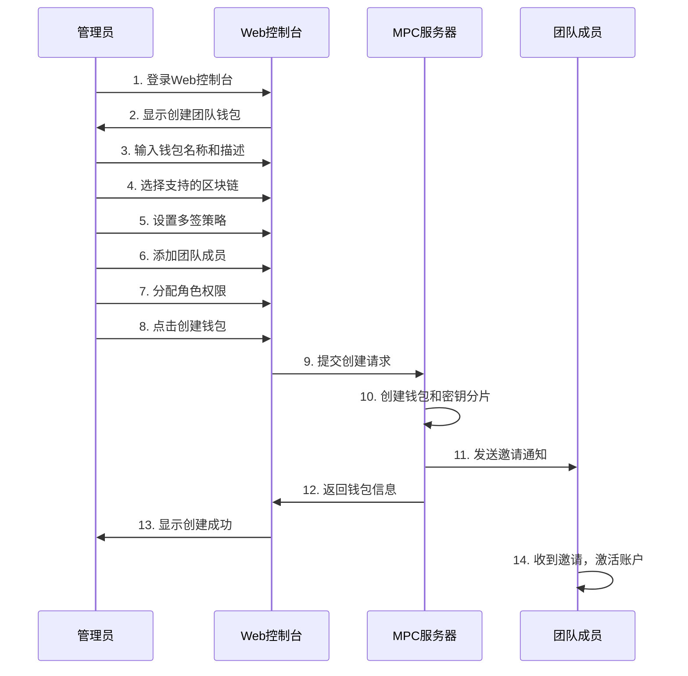
```mermaid
sequenceDiagram
    participant Admin as 管理员
    participant Web as Web控制台
    participant Server as MPC服务器
    participant Team as 团队成员

    Admin->>Web: 1. 登录Web控制台
    Web->>Admin: 2. 显示创建团队钱包
    Admin->>Web: 3. 输入钱包名称和描述
    Admin->>Web: 4. 选择支持的区块链
    Admin->>Web: 5. 设置多签策略
    Admin->>Web: 6. 添加团队成员
    Admin->>Web: 7. 分配角色权限
    Admin->>Web: 8. 点击创建钱包
    Web->>Server: 9. 提交创建请求
    Server->>Server: 10. 创建钱包和密钥分片
    Server->>Team: 11. 发送邀请通知
    Server->>Web: 12. 返回钱包信息
    Web->>Admin: 13. 显示创建成功
    Team->>Team: 14. 收到邀请，激活账户
```

#### 5.1.2 详细步骤说明

**步骤 1：创建团队**
- 管理员登录Web控制台
- 点击"创建团队"或"团队管理"
- 输入团队名称（如"公司财务团队"）
- 输入团队描述（可选）
- 设置团队基本信息
- 点击"创建团队"

**步骤 2：邀请团队成员**
- 在团队管理页面，点击"添加成员"
- 输入成员邮箱或用户名
- 分配角色：
  - **Owner（所有者）**：完全控制权限
  - **Manager（管理者）**：可以批准交易和管理成员
  - **Member（成员）**：可以创建交易请求
- 设置每个成员的审批权限
- 点击"发送邀请"
- 系统自动发送邀请邮件给团队成员
- 团队成员收到邀请后，激活账户并安装APP

**步骤 3：创建团队钱包**
- 在团队页面，点击"创建团队钱包"
- 输入钱包名称（如"公司主钱包"）
- 输入描述信息（可选）
- 选择支持的区块链（Bitcoin、Ethereum等）

**步骤 4：选择密钥分片分配模式**
- **模式一：部署Client Signer（企业推荐）**
  - 如果已部署Client Signer，选择此模式
  - 密钥分片分配：Client Signer（分片1）+ 云端代理1（分片2）+ 云端代理2（分片3）
  - 3-of-3模式，需要所有3个分片参与签名
  
- **模式二：每个团队成员一个分片（M-of-N阈值模式）**
  - 选择此模式后，需要配置阈值参数
  - **选择阈值模式**：
    - 输入团队成员总数（N）
    - 输入签名所需的最小成员数（M）
    - 例如：5个成员，选择3-of-5（需要3个成员参与即可签名）
  - 密钥分片分配：每个团队成员设备持有1个分片
  - M-of-N模式，只需要M个分片参与即可签名（容错N-M个成员）

- **模式三：所有分片在云端（不推荐企业使用）**
  - 仅适用于个人用户或小型团队
  - 密钥分片分配：3个分片都在云端代理
  - 3-of-3模式，需要所有3个分片参与签名

**步骤 5：设置多签策略（业务层面审批）**
- **简单模式**：统一审批要求
  - 例如：所有交易需要2个管理员批准
- **高级模式**：基于条件的策略
  - 小额交易（< 1000 USDT）：1个管理员批准
  - 大额交易（≥ 10000 USDT）：3个管理员批准
  - 白名单地址：自动批准
  - 未知金额交易：2个管理员批准

**步骤 6：执行分布式密钥生成（DKG）**

根据选择的模式，DKG过程不同：

**情况A：模式一（Client Signer）或模式三（全云端）**
```
DKG参与方（3个）：
├── 参与方1：Client Signer服务器（模式一）或云端代理1（模式三）
├── 参与方2：云端代理1
└── 参与方3：云端代理2

DKG流程：
1. Coordinator（MPC服务器）创建DKG会话
2. 通知3个参与方加入DKG会话
3. 每个参与方在自己的安全环境中独立生成随机数
4. 参与方之间交换和验证承诺（Commitment）
5. 参与方之间交换随机数，验证承诺
6. 每个参与方计算自己的密钥分片
7. 计算公钥（所有参与方协作计算）
8. 每个参与方将密钥分片存储在自己的安全环境中
9. DKG完成，生成钱包地址

安全保证：
- ✅ 密钥分片在生成过程中就存储在各自环境中，永不离开
- ✅ Coordinator只负责协调通信，不接触任何分片
- ✅ 任何单一参与方都无法获得完整私钥
```

**情况B：模式二（M-of-N阈值模式）**
```
DKG参与方（N个，N=团队成员数）：
├── 参与方1：团队成员1的设备
├── 参与方2：团队成员2的设备
├── 参与方3：团队成员3的设备
├── ...
└── 参与方N：团队成员N的设备

DKG流程：
1. Coordinator（MPC服务器）创建DKG会话
2. 通知所有N个团队成员设备加入DKG会话
3. 每个成员设备在自己的Secure Enclave/TrustZone中独立生成随机数
4. 成员设备之间通过安全通道交换和验证承诺（Commitment）
5. 成员设备之间交换随机数，验证承诺
6. 每个成员设备计算自己的密钥分片
7. 计算公钥（所有参与方协作计算）
8. 每个成员设备将密钥分片存储在自己的Secure Enclave/TrustZone中
9. DKG完成，生成钱包地址

安全保证：
- ✅ 密钥分片在生成过程中就存储在各自设备中，永不离开
- ✅ Coordinator只负责协调通信，不接触任何分片
- ✅ 任何单一成员设备都无法获得完整私钥
- ✅ 需要M个分片参与才能签名（阈值模式）
```

**步骤 7：完成创建**
- DKG完成后，系统自动生成钱包地址
- 显示钱包地址和二维码
- 显示密钥分片分配信息：
  - **模式一/模式三**：显示3个分片的存储位置
  - **模式二**：显示N个分片的分配情况（每个成员设备持有1个分片）
- 显示阈值配置（如果是模式二）
- 发送通知给团队成员（钱包创建成功）

**重要说明**：

**模式一/模式三（3-of-3模式）**：
- ⚠️ **密钥分片分配是技术层面的**：3个分片存储在固定位置，不随团队成员变化
- ⚠️ **分片不存储在团队成员设备中**：团队成员通过APP批准（业务层面），不直接持有密钥分片
- ⚠️ **团队审批是业务层面实现**：
  - 通过数据库和业务逻辑实现
  - 团队成员通过APP批准，记录到数据库
  - 达到审批阈值后，触发MPC签名流程（技术层面）
- ✅ **两个层面完全独立**：
  - **业务层面**：团队审批（通过数据库实现）
  - **技术层面**：MPC签名（通过MPC协议实现）

**模式二（M-of-N阈值模式）**：
- ✅ **密钥分片分配是技术层面的**：N个分片存储在团队成员设备中，每个成员持有1个分片
- ✅ **分片存储在团队成员设备中**：每个成员的设备在自己的Secure Enclave/TrustZone中存储1个分片
- ✅ **团队审批和MPC签名结合**：
  - 业务层面：团队成员通过APP批准，记录到数据库
  - 技术层面：达到审批阈值后，对应的M个成员设备参与MPC签名（使用各自的分片）
  - 只需要M个分片参与即可完成签名（容错N-M个成员）
- ✅ **两个层面协同工作**：
  - **业务层面**：团队审批（需要多少个团队成员批准）- 通过数据库实现
  - **技术层面**：MPC签名（需要M个密钥分片参与）- 通过MPC协议实现
  - **关键**：审批的成员和参与签名的成员设备是同一批人

#### 5.1.3 多签策略示例

**示例一：简单统一策略**
```
所有交易需要 2 个 Manager 批准
适用场景：小团队，交易频率低
```

**示例二：基于金额的策略**
```
- 小额交易（< 1,000 USDT）：1 个 Manager 批准
- 中等交易（1,000 - 10,000 USDT）：2 个 Manager 批准
- 大额交易（≥ 10,000 USDT）：3 个 Manager 批准
适用场景：企业财务，需要分级审批
```

**示例三：基于地址的策略**
```
- 白名单地址：自动批准（无需审批）
- 普通地址：2 个 Manager 批准
- 黑名单地址：禁止交易
适用场景：定期支付，需要白名单管理
```

### 5.2 场景二：团队转账审批

#### 5.2.1 使用流程

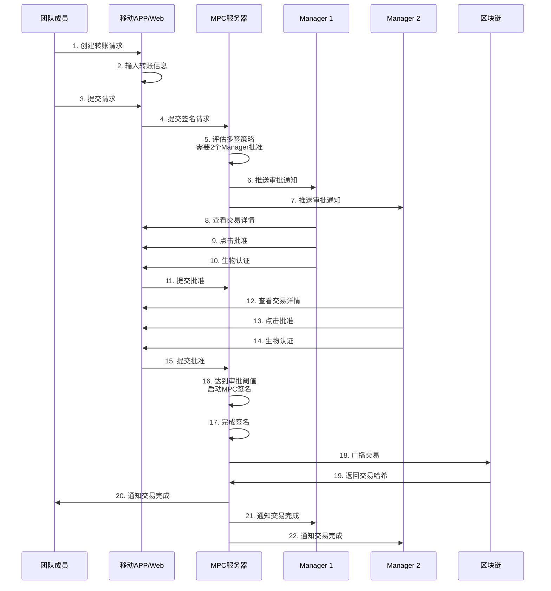
```mermaid
sequenceDiagram
    participant Member as 团队成员
    participant APP as 移动APP/Web
    participant Server as MPC服务器
    participant M1 as Manager 1
    participant M2 as Manager 2
    participant Blockchain as 区块链

    Member->>APP: 1. 创建转账请求
    APP->>APP: 2. 输入转账信息
    Member->>APP: 3. 提交请求
    APP->>Server: 4. 提交签名请求
    Server->>Server: 5. 评估多签策略<br/>需要2个Manager批准
    Server->>M1: 6. 推送审批通知
    Server->>M2: 7. 推送审批通知
    M1->>APP: 8. 查看交易详情
    M1->>APP: 9. 点击批准
    M1->>APP: 10. 生物认证
    APP->>Server: 11. 提交批准
    M2->>APP: 12. 查看交易详情
    M2->>APP: 13. 点击批准
    M2->>APP: 14. 生物认证
    APP->>Server: 15. 提交批准
    Server->>Server: 16. 达到审批阈值<br/>启动MPC签名
    Server->>Server: 17. 完成签名
    Server->>Blockchain: 18. 广播交易
    Blockchain->>Server: 19. 返回交易哈希
    Server->>Member: 20. 通知交易完成
    Server->>M1: 21. 通知交易完成
    Server->>M2: 22. 通知交易完成
```

#### 4.2.2 详细步骤说明

**步骤 1-3：创建转账请求**
- 团队成员（Member或Manager）打开APP或Web控制台
- 选择团队钱包
- 点击"转账"
- 输入收款地址、金额、代币类型
- 可选：添加备注说明
- 提交请求

**步骤 4-7：系统评估和通知**
- 系统自动评估多签策略
- 根据交易金额和地址，确定需要的审批人数
- 自动推送通知给需要审批的Manager
- 通知包含：交易详情、需要审批的原因

**步骤 8-15：审批流程**
- Manager收到通知，打开APP
- 查看交易详情：
  - 发起人信息
  - 收款地址
  - 转账金额
  - 手续费
  - 交易时间
- 仔细核对信息
- 点击"批准"或"拒绝"
- 进行生物认证确认
- 提交审批结果

**步骤 16-22：执行交易**
- 当达到审批阈值时，系统自动启动MPC签名
- 后台完成签名（用户无需操作）
- 自动广播交易到区块链
- 所有相关人员收到交易完成通知
- 显示交易哈希，可追踪状态

#### 5.2.3 审批界面说明

**审批列表界面**：
- 显示所有待审批的交易
- 显示交易状态（待审批、已批准、已拒绝、已完成）
- 显示交易金额和类型
- 显示发起人信息
- 显示审批进度（已批准/需要批准）

**交易详情界面**：
- 完整的交易信息
- 审批历史记录
- 当前审批状态
- 预计完成时间

#### 5.2.4 用户体验要点

- **及时通知**：审批请求实时推送
- **清晰展示**：交易信息清晰易读
- **快速审批**：一键批准，生物认证确认
- **状态追踪**：实时显示审批进度和交易状态

### 5.3 场景三：批量操作

#### 5.3.1 批量转账流程

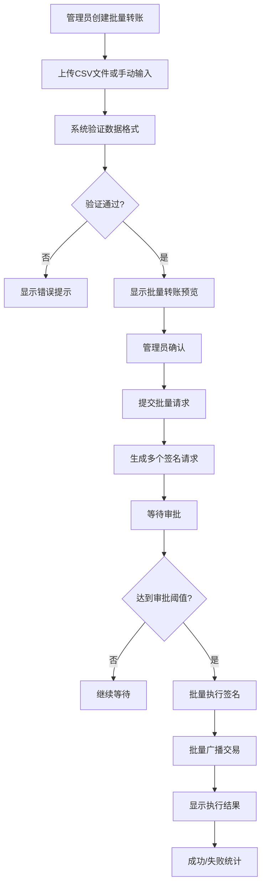
```mermaid
flowchart TD
    A[管理员创建批量转账] --> B[上传CSV文件或手动输入]
    B --> C[系统验证数据格式]
    C --> D{验证通过?}
    D -->|否| E[显示错误提示]
    D -->|是| F[显示批量转账预览]
    F --> G[管理员确认]
    G --> H[提交批量请求]
    H --> I[生成多个签名请求]
    I --> J[等待审批]
    J --> K{达到审批阈值?}
    K -->|否| L[继续等待]
    K -->|是| M[批量执行签名]
    M --> N[批量广播交易]
    N --> O[显示执行结果]
    O --> P[成功/失败统计]
```

#### 5.3.2 使用场景

**场景一：工资发放**
- 企业每月发放员工工资
- 上传员工地址和金额列表
- 系统自动创建批量转账请求
- 管理员审批后批量执行

**场景二：空投活动**
- 项目方进行代币空投
- 上传用户地址列表
- 设置统一的空投金额
- 批量执行空投

**场景三：供应商付款**
- 定期向供应商付款
- 上传供应商地址和金额
- 设置付款时间
- 自动批量执行

#### 5.3.3 详细步骤说明

**步骤 1-3：准备数据**
- 管理员登录Web控制台
- 选择"批量转账"
- 上传CSV文件或手动输入：
  - 收款地址
  - 转账金额
  - 代币类型
  - 备注信息（可选）

**步骤 4-6：验证和预览**
- 系统自动验证数据格式
- 检查地址有效性
- 检查余额是否充足
- 显示批量转账预览：
  - 总笔数
  - 总金额
  - 手续费估算
  - 预计完成时间

**步骤 7-9：提交和审批**
- 管理员确认预览信息
- 提交批量转账请求
- 系统自动创建多个签名请求
- 根据多签策略，等待审批

**步骤 10-12：执行和结果**
- 达到审批阈值后，批量执行
- 系统自动处理每笔交易
- 显示执行结果：
  - 成功笔数
  - 失败笔数
  - 失败原因
  - 交易哈希列表

#### 5.3.4 批量操作优势

- **效率提升**：一次操作完成多笔转账
- **统一管理**：所有交易统一审批和执行
- **错误处理**：自动处理失败交易，提供详细报告
- **成本优化**：批量处理降低手续费

### 5.4 场景四：团队管理

#### 5.4.1 成员管理流程

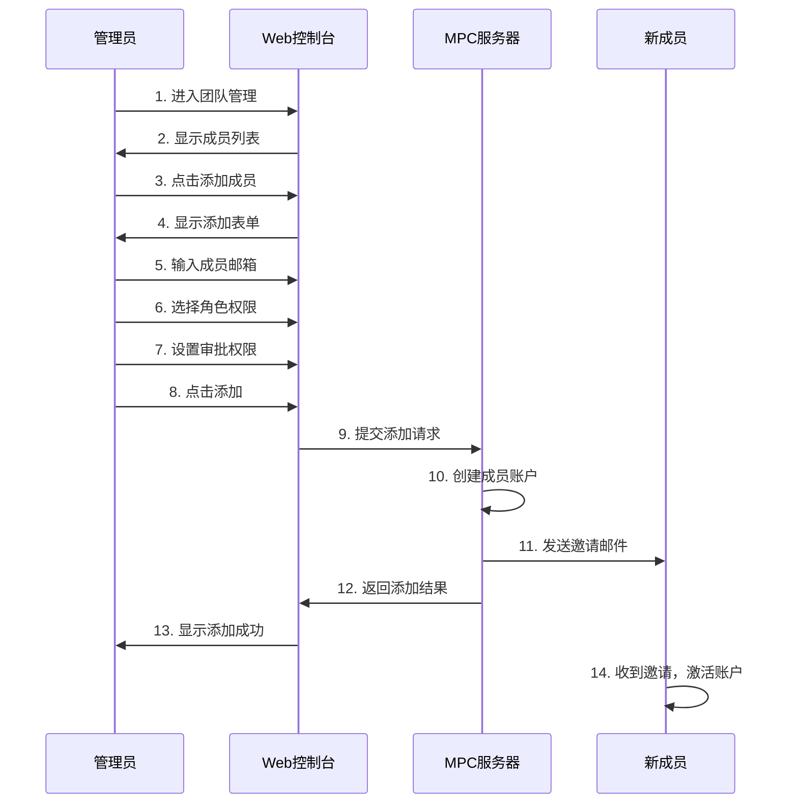
```mermaid
sequenceDiagram
    participant Admin as 管理员
    participant Web as Web控制台
    participant Server as MPC服务器
    participant NewMember as 新成员

    Admin->>Web: 1. 进入团队管理
    Web->>Admin: 2. 显示成员列表
    Admin->>Web: 3. 点击添加成员
    Web->>Admin: 4. 显示添加表单
    Admin->>Web: 5. 输入成员邮箱
    Admin->>Web: 6. 选择角色权限
    Admin->>Web: 7. 设置审批权限
    Admin->>Web: 8. 点击添加
    Web->>Server: 9. 提交添加请求
    Server->>Server: 10. 创建成员账户
    Server->>NewMember: 11. 发送邀请邮件
    Server->>Web: 12. 返回添加结果
    Web->>Admin: 13. 显示添加成功
    NewMember->>NewMember: 14. 收到邀请，激活账户
```

#### 5.4.2 角色权限说明

**Owner（所有者）**
- ✅ 完全控制权限
- ✅ 可以管理所有成员
- ✅ 可以修改多签策略
- ✅ 可以导出备份
- ✅ 可以删除钱包

**Manager（管理者）**
- ✅ 可以批准交易
- ✅ 可以管理部分成员（有限权限）
- ✅ 可以创建交易请求
- ❌ 不能修改多签策略
- ❌ 不能导出备份

**Member（成员）**
- ✅ 可以创建交易请求
- ❌ 不能批准交易
- ❌ 不能管理成员

#### 5.4.3 权限管理示例

**示例：财务部门权限设置**
```
- 财务总监（Owner）：完全控制
- 财务经理（Manager × 2）：可以批准交易
- 财务专员（Member × 3）：可以创建交易请求

审批策略：
- 小额交易（< 5,000 USDT）：1 个 Manager 批准
- 大额交易（≥ 5,000 USDT）：2 个 Manager 批准
```

### 5.5 场景五：Client Signer 程序化签名

#### 5.5.1 什么是 Client Signer？

**Client Signer（客户端签名器）** 是一个程序化签名服务，用于自动化创建和签名交易。它持有密钥分片，可以自动参与 MPC 签名计算。

**适用场景**：
- ✅ 需要自动化创建交易（如批量工资发放、空投）
- ✅ 需要7x24小时服务（高频交易场景）
- ✅ 需要与业务系统集成（API调用）
- ✅ 需要减少人工干预（提高效率）

**与手动批准的区别**：

| 特性 | 手动批准（APP） | Client Signer |
|------|---------------|---------------|
| **使用方式** | 团队成员通过APP批准 | 程序化自动签名 |
| **适用场景** | 日常交易审批 | 批量操作、自动化流程 |
| **响应速度** | 依赖人工响应 | 自动响应，毫秒级 |
| **部署要求** | 无需部署 | 需要部署Client Signer服务 |
| **安全级别** | 人工审核，安全性高 | 需要配置验证规则 |

#### 5.5.2 是否需要部署 Client Signer？

**答案：不是必须的，取决于使用场景。**

**场景一：纯手动批准（不需要 Client Signer）**

```
适用场景：
- 小团队（<10人）
- 交易频率低
- 需要人工审核

工作方式：
- 团队成员通过APP批准交易
- 无需部署Client Signer
- 简单易用
```

**场景二：混合模式（推荐用于企业）**

```
适用场景：
- 需要自动化创建交易
- 需要批量处理
- 需要与业务系统集成

工作方式：
- 业务系统部署Client Signer（程序化创建交易）
- 团队成员通过APP批准
- 结合自动化和人工审核
```

**场景三：完全程序化（高级场景）**

```
适用场景：
- 高频交易
- 7x24小时服务
- 完全自动化流程

工作方式：
- 部署多个Client Signer（高可用）
- 配置自动批准规则
- 完全自动化处理
```

#### 5.5.3 Client Signer 使用流程

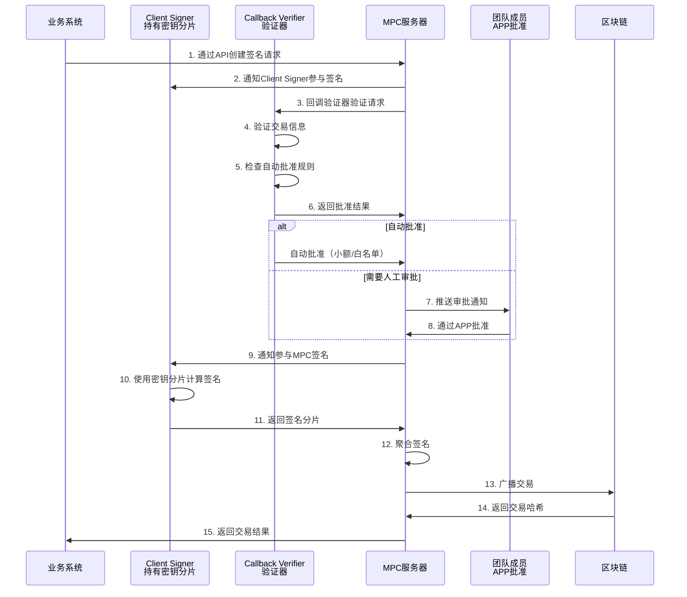
```mermaid
sequenceDiagram
    participant System as 业务系统
    participant Signer as Client Signer<br/>持有密钥分片
    participant Verifier as Callback Verifier<br/>验证器
    participant Server as MPC服务器
    participant Manager as 团队成员<br/>APP批准
    participant Blockchain as 区块链

    System->>Server: 1. 通过API创建签名请求
    Server->>Signer: 2. 通知Client Signer参与签名
    Server->>Verifier: 3. 回调验证器验证请求
    Verifier->>Verifier: 4. 验证交易信息
    Verifier->>Verifier: 5. 检查自动批准规则
    Verifier->>Server: 6. 返回批准结果
    
    alt 自动批准
        Verifier->>Server: 自动批准（小额/白名单）
    else 需要人工审批
        Server->>Manager: 7. 推送审批通知
        Manager->>Server: 8. 通过APP批准
    end
    
    Server->>Signer: 9. 通知参与MPC签名
    Signer->>Signer: 10. 使用密钥分片计算签名
    Signer->>Server: 11. 返回签名分片
    Server->>Server: 12. 聚合签名
    Server->>Blockchain: 13. 广播交易
    Blockchain->>Server: 14. 返回交易哈希
    Server->>System: 15. 返回交易结果
```

#### 5.5.4 部署 Client Signer 的步骤

**步骤1：生成密钥对**

```bash
# 生成Ed25519密钥对（用于Client Signer身份认证）
ssh-keygen -t ed25519 -C "client_signer_production"
# 不要设置密码
# 保存私钥到安全位置
```

**步骤2：在Web控制台创建Client Signer**

1. 登录Web控制台
2. 进入"团队与交易策略"页面
3. 点击"新建Client Signer"
4. 输入信息：
   - **名称**：Client Signer的唯一标识
   - **公钥**：粘贴刚才生成的公钥内容
   - **IP白名单**：指定最多3个IP地址（可选，提高安全性）
5. 点击"确认"
6. 等待管理员审批（需要多签审批）

**步骤3：配置密钥访问权限**

- 选择Client Signer可以访问的密钥
- 设置访问级别（只读/读写）
- 配置自动批准规则（可选）

**步骤4：部署Client Signer服务**

Client Signer需要部署在您的服务器上，可以：
- 部署在业务系统同一服务器
- 部署在独立的服务器（推荐，提高安全性）
- 部署多个实例（高可用）

#### 5.5.5 Client Signer 使用示例

**示例一：批量工资发放**

```python
# 业务系统通过API创建批量转账
import requests

# 1. 创建批量转账请求
batch_request = {
    "wallet_id": "wallet-123",
    "items": [
        {"address": "0x123...", "amount": "1000", "token": "USDT"},
        {"address": "0x456...", "amount": "2000", "token": "USDT"},
        # ... 更多员工
    ]
}

response = requests.post(
    "https://api.mpc.example.com/v1/batch-transfer",
    json=batch_request,
    headers={"Authorization": "Bearer YOUR_API_KEY"}
)

# 2. Client Signer自动参与签名
# 3. 系统自动处理每笔交易
# 4. 返回执行结果
```

**示例二：自动空投**

```python
# 项目方进行代币空投
airdrop_request = {
    "wallet_id": "wallet-456",
    "token": "PROJECT_TOKEN",
    "amount_per_user": "100",
    "addresses": [
        "0x111...",
        "0x222...",
        # ... 用户地址列表
    ]
}

# Client Signer自动处理，无需人工干预
```

#### 5.5.6 安全配置建议

**自动批准规则配置**：

```yaml
auto_approval_rules:
  # 小额交易自动批准
  - condition:
      amount: "< 1000"
      currency: "USDT"
    action: "auto_approve"
  
  # 白名单地址自动批准
  - condition:
      destination: "whitelist"
    action: "auto_approve"
  
  # 大额交易需要人工审批
  - condition:
      amount: ">= 10000"
      currency: "USDT"
    action: "require_manual_approval"
```

**安全建议**：
- ✅ 设置IP白名单，限制Client Signer访问来源
- ✅ 配置自动批准规则，避免大额交易自动执行
- ✅ 定期审查Client Signer的访问权限
- ✅ 监控Client Signer的操作日志
- ✅ 部署多个Client Signer实现高可用

#### 5.5.7 常见问题

**Q: 每个团队成员都需要部署Client Signer吗？**
A: 不是。Client Signer主要用于程序化签名场景。团队成员可以通过APP进行手动批准，无需部署Client Signer。

**Q: Client Signer和团队成员批准有什么区别？**
A: 
- **Client Signer**：程序化自动签名，适合批量操作和自动化流程
- **团队成员批准**：人工审核批准，适合需要人工判断的场景
- 两者可以结合使用：Client Signer创建交易，团队成员批准

**Q: 部署Client Signer安全吗？**
A: 是的，但需要正确配置：
- 设置IP白名单
- 配置自动批准规则
- 定期审查权限
- 监控操作日志

### 5.6 场景六：审计与合规

#### 5.6.1 审计日志查看

```mermaid
flowchart TD
    A[管理员登录] --> B[进入审计日志]
    B --> C[选择筛选条件]
    C --> D[时间范围]
    C --> E[操作类型]
    C --> F[用户/钱包]
    D --> G[显示审计日志]
    E --> G
    F --> G
    G --> H[查看详细信息]
    H --> I[导出日志]
```

#### 5.6.2 审计日志内容

**记录的操作类型**：
- 钱包创建和删除
- 交易创建和审批
- 成员添加和删除
- 策略修改
- 备份导出
- 权限变更

**每条日志包含**：
- 操作时间
- 操作人员
- 操作类型
- 操作详情
- 操作结果（成功/失败）
- IP地址
- 设备信息

#### 5.6.3 合规报告

**自动生成报告**：
- 每日交易汇总
- 每周资产变动
- 每月合规报告
- 异常交易告警

**报告内容**：
- 交易统计（笔数、金额）
- 资产余额变化
- 审批流程记录
- 异常操作记录

---

## 6. 混合使用场景

### 5.1 场景一：个人钱包与团队钱包

#### 5.1.1 使用场景

用户同时拥有：
- **个人钱包**：用于个人资产管理和日常使用
- **团队钱包**：用于团队协作和企业资产管理

#### 5.1.2 跨钱包转账

```mermaid
sequenceDiagram
    participant User as 用户
    participant Personal as 个人钱包APP
    participant Team as 团队钱包
    participant Server as MPC服务器
    participant Blockchain as 区块链

    User->>Personal: 1. 选择个人钱包
    Personal->>User: 2. 显示转账界面
    User->>Personal: 3. 输入团队钱包地址
    User->>Personal: 4. 输入转账金额
    User->>Personal: 5. 确认转账
    Personal->>User: 6. 生物认证
    Personal->>Server: 7. 提交签名请求
    Server->>Server: 8. 完成个人钱包签名
    Server->>Blockchain: 9. 广播交易
    Blockchain->>Team: 10. 资产到账
    Team->>User: 11. 通知资产到账
```

#### 5.1.3 统一管理界面

- **钱包列表**：显示所有钱包（个人+团队）
- **快速切换**：一键切换不同钱包
- **统一视图**：查看所有资产总览
- **分别管理**：每个钱包独立管理

### 5.2 场景二：权限继承

#### 5.2.1 使用场景

企业组织架构中，上级钱包可以控制下级钱包：
- 总公司钱包 → 分公司钱包
- 主账户钱包 → 子账户钱包

#### 5.2.2 权限继承流程

```mermaid
graph TD
    A[总公司钱包<br/>Owner权限] --> B[分公司A钱包<br/>Manager权限]
    A --> C[分公司B钱包<br/>Manager权限]
    B --> D[部门1钱包<br/>Member权限]
    B --> E[部门2钱包<br/>Member权限]
    
    style A fill:#e1f5fe
    style B fill:#f3e5f5
    style C fill:#f3e5f5
    style D fill:#e8f5e8
    style E fill:#e8f5e8
```

#### 5.2.3 权限控制规则

- **上级可以管理下级**：Owner可以管理所有下级钱包
- **下级独立运营**：每个钱包独立的多签策略
- **统一审计**：所有操作统一记录在审计日志中

---

## 7. 常见问题解答

### 6.1 安全性问题

**Q: 个人用户是否保留私钥分片？**
A: 是的。个人用户采用 3-of-3 模式，您的手机设备会持有 1 个密钥分片，存储在 Secure Enclave/TrustZone 中，通过生物认证保护。另外 2 个分片存储在云端安全环境中。只有三个分片同时参与才能完成签名，确保您对资产的控制权，同时保证安全性。

**Q: 如果我的手机丢失了，资产会丢失吗？**
A: 不会。MPC钱包的密钥分片存储在多个安全环境中：
- 您的手机持有 1 个分片（可通过备份恢复）
- 云端持有 2 个分片（仍然安全）
即使手机丢失，您可以通过备份恢复钱包，或者通过其他设备访问资产。即使攻击者获得了您的手机，也无法单独控制资产，因为还需要云端的分片。

**Q: 云端服务被攻击怎么办？**
A: MPC钱包采用零信任架构，即使某个环境被攻击，攻击者也无法获得完整的密钥。需要多个分片才能控制资产，大大降低了风险。

**Q: 生物认证安全吗？**
A: 生物认证只是用于本地设备解锁，真正的密钥分片存储在安全环境中。即使生物认证被绕过，攻击者也无法获得密钥分片。

### 6.2 使用问题

**Q: 转账需要多长时间？**
A: 通常转账在几秒到几分钟内完成，具体取决于：
- 区块链网络拥堵情况
- 手续费设置
- 多签审批时间（团队钱包）

**Q: 可以撤销交易吗？**
A: 区块链交易一旦确认就无法撤销。在提交交易前，请仔细核对交易信息。团队钱包可以通过多签审批机制，在交易确认前取消。

**Q: 支持哪些区块链？**
A: 支持主流区块链，包括：
- Bitcoin (BTC)
- Ethereum (ETH) 及所有ERC-20代币
- 其他主流区块链（根据配置）

### 6.3 团队管理问题

**Q: 团队成员需要都安装APP吗？**
A: 不是必须的。团队成员可以通过以下方式参与：
- 移动APP（推荐，便捷）
- Web控制台（适合桌面办公）
- API集成（适合自动化场景）

**Q: 如何设置多签策略？**
A: 在创建团队钱包时，可以选择：
- **简单模式**：统一审批要求
- **高级模式**：基于金额、地址、类型的策略

**Q: 可以修改多签策略吗？**
A: 可以。Owner或Manager可以修改多签策略，修改需要经过审批流程。

**Q: 团队钱包也是用三个分片吗？存在APP内的分片在哪一个成员那儿呢？**
A: 是的，团队钱包也采用 3-of-3 模式，但需要区分两个层面：

**技术层面（密钥分片）**：
- 团队钱包的密钥分片分配固定为3个分片：
  - **如果部署了Client Signer**：
    - 分片1：Client Signer服务器持有
    - 分片2：云端代理1持有
    - 分片3：云端代理2持有
  - **如果未部署Client Signer**：
    - 分片1：云端代理3持有（第三个云端环境）
    - 分片2：云端代理1持有
    - 分片3：云端代理2持有
- **重要**：密钥分片不存储在团队成员的个人APP中
- **重要**：密钥分片分配是固定的，不随团队成员变化

**业务层面（团队审批）**：
- **审批是业务层面实现**：通过数据库和业务逻辑实现
  - 团队成员通过APP批准，记录到数据库
  - 系统检查审批数量，达到阈值后触发MPC签名
  - 不涉及密钥分片，纯粹是业务逻辑
- 团队成员不直接持有密钥分片
- 达到审批阈值后，启动MPC签名流程（技术层面）

**关键理解**：
- ❌ **误解**：每个团队成员都持有密钥分片
- ❌ **误解**：审批需要密钥分片参与
- ✅ **正确**：密钥分片只有3个，存储在固定位置（Client Signer或云端代理）
- ✅ **正确**：团队成员通过APP批准，这是业务层面的审批，通过数据库实现
- ✅ **正确**：审批和签名是两个独立的系统，审批通过后才触发MPC签名

**示例**：
```
场景：团队有5个成员，需要2个Manager批准

密钥分片（技术层面，固定3个）：
- 如果部署了Client Signer：
  - 分片1：Client Signer持有
  - 分片2：云端代理1持有
  - 分片3：云端代理2持有
- 如果未部署Client Signer：
  - 分片1：云端代理3持有
  - 分片2：云端代理1持有
  - 分片3：云端代理2持有

团队审批（业务层面，通过数据库实现）：
- 5个团队成员都可以通过APP批准
- 审批记录到数据库（不涉及密钥分片）
- 策略要求：需要2个Manager批准
- 系统检查：达到2个批准后，触发MPC签名流程
- MPC签名：3个密钥分片协作完成签名
```

**Q: 审批是业务层面实现吗？如果没部署Client Signer，第三个私钥分片怎么办？**
A: 是的，审批是业务层面实现。详细说明如下：

**审批是业务层面实现**：
- ✅ 通过数据库和业务逻辑实现
- ✅ 团队成员通过APP批准，记录到数据库
- ✅ 系统检查审批数量，达到阈值后触发MPC签名
- ✅ 不涉及密钥分片，纯粹是业务逻辑
- ✅ 审批和签名是两个独立的系统

**如果没部署Client Signer，分片分配方案**：
- **分片1**：存储在云端代理3（第三个云端环境）
- **分片2**：存储在云端代理1
- **分片3**：存储在云端代理2
- 3个分片都存储在云端，但分布在不同的云端环境或TEE实例中
- 确保分片隔离，即使某个云端环境被攻击，也无法获得所有分片

**安全保证**：
- ✅ 即使3个分片都在云端，也分布在不同的环境
- ✅ 每个环境独立运行，分片互不可见
- ✅ 即使某个环境被攻击，攻击者只能获得1个分片
- ✅ 需要3个分片全部参与才能签名，攻击者无法单独控制资产

### 6.4 备份恢复问题

**Q: 如何备份钱包？**
A: MPC钱包提供以下备份方式：
- **备份文件**（推荐）：加密的备份文件，包含密钥分片信息
- **云端同步**：自动同步到云端，在新设备上登录即可恢复
- **个人密钥证书备份**：用于身份认证的密钥（不是钱包私钥）

⚠️ **注意**：MPC钱包无法使用传统助记词备份，因为私钥永不完整存在。

**Q: 为什么不能使用助记词备份？**
A: 因为MPC钱包的私钥被分成3个分片，分别存储在不同的安全环境中，私钥永不完整存在。传统助记词（BIP39）对应完整私钥，所以无法生成。但备份文件同样安全可靠，且已加密保护。

**Q: 备份文件丢失怎么办？**
A: 建议使用多种方式备份：
- 备份文件存储在多个安全位置（云盘、硬件设备、离线存储）
- 使用云端同步作为备用方案
- 定期更新备份，特别是添加新密钥后
- 定期测试备份文件是否可以成功恢复

**Q: 恢复钱包需要多长时间？**
A: 恢复过程通常在几分钟内完成，具体取决于：
- 备份方式（备份文件需要上传和解密）
- 网络状况
- 需要恢复的资产数量
- 云端同步通常更快

---

## 8. 最佳实践

### 7.1 个人用户最佳实践

**安全建议**：
- ✅ 启用生物认证
- ✅ 定期更新APP
- ✅ 使用强密码保护APP
- ✅ 多重备份（备份文件+云端同步）
- ✅ 不要分享备份文件给他人
- ✅ 定期测试备份文件是否可以成功恢复

**使用建议**：
- ✅ 大额转账前先小额测试
- ✅ 仔细核对收款地址
- ✅ 定期检查资产余额
- ✅ 关注交易状态通知

### 7.2 团队用户最佳实践

**管理建议**：
- ✅ 合理设置多签策略
- ✅ 定期审查团队成员权限
- ✅ 设置合理的审批流程
- ✅ 启用审计日志

**安全建议**：
- ✅ 限制Owner数量（建议1-2个）
- ✅ Manager权限分离（不同部门）
- ✅ 定期轮换审批人员
- ✅ 设置异常交易告警

**操作建议**：
- ✅ 批量操作前先测试
- ✅ 大额交易多重确认
- ✅ 定期备份团队钱包
- ✅ 建立应急响应流程

### 7.3 混合使用最佳实践

**钱包分离**：
- ✅ 个人钱包和团队钱包分开管理
- ✅ 不同用途使用不同钱包
- ✅ 定期检查钱包权限

**权限管理**：
- ✅ 明确每个钱包的用途
- ✅ 避免权限交叉
- ✅ 定期审查权限设置

---

## 8. 总结

### 8.1 产品优势

**对于个人用户**：
- 🔐 企业级安全保护
- 📱 便捷的移动APP
- 🌐 多链统一管理
- 💰 资产完全掌控

**对于团队用户**：
- 👥 灵活的多签审批
- 📊 完整的审计追踪
- ⚡ 高效的批量操作
- 🏢 满足合规要求

### 8.2 适用场景

**个人用户适用**：
- 数字资产持有者
- DeFi协议用户
- NFT收藏者
- 多链资产管理

**团队用户适用**：
- 企业财务部门
- 数字资产交易所
- DeFi协议团队
- 投资机构

### 8.3 未来规划

**即将推出**：
- 🔜 更多区块链支持
- 🔜 高级DeFi功能
- 🔜 跨链桥接
- 🔜 智能合约管理

**持续优化**：
- 📈 性能优化
- 🛡️ 安全增强
- 🎨 用户体验改进
- 📚 文档完善

---

**文档版本**: v1.0  
**最后更新**: 2025-01-02  
**维护团队**: MPC 产品团队  
**反馈渠道**: 如有问题或建议，请联系产品团队

---

## 附录

### A. 术语表

- **MPC**: 多方安全计算（Multi-Party Computation）
- **多签**: 多重签名，需要多个签名才能执行交易
- **密钥分片**: 将私钥分成多个部分，分别存储在不同的安全环境中
- **审批阈值**: 需要多少个审批才能执行交易
- **DKG**: 分布式密钥生成（Distributed Key Generation），多个参与方协作生成密钥分片
- **备份文件**: 加密的备份文件，包含密钥分片信息，用于恢复钱包
- **个人密钥证书**: Ed25519密钥对，用于身份认证（不是钱包私钥）
- **交易哈希**: 区块链上交易的唯一标识

### B. 支持渠道

- **官方网站**: [待补充]
- **用户手册**: [待补充]
- **技术支持**: [待补充]
- **社区论坛**: [待补充]

### C. 更新日志

**v1.0 (2025-01-02)**
- 初始版本发布
- 包含个人和团队使用场景
- 详细的流程图和说明
